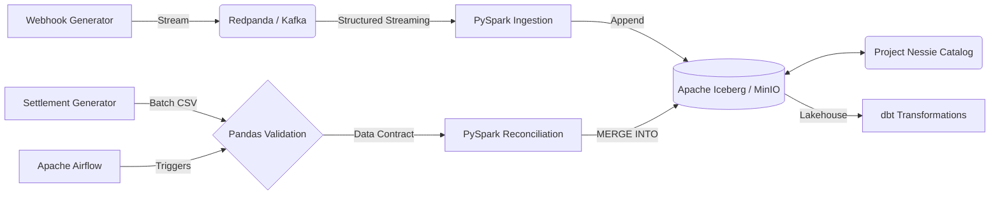

# Transaction Reconciliation Engine

**What it is:** A local data lakehouse designed to automate financial reconciliation.
**What it does:** It matches real-time payment gateway webhooks against delayed batch bank settlement files.
**How it does it:** Real-time webhooks are streamed via Redpanda/Kafka and ingested via PySpark into Apache Iceberg. Settlement CSVs are validated using Pandas and merged into the Iceberg table using ACID `MERGE INTO` upserts.
**Why it's needed:** Finance teams typically manually match these datasets (which arrive days apart) to verify Merchant Discount Rates (MDR) and settle funds. This system automates the matching and flags fee discrepancies at scale.

## Key Results

| Metric                | Result |
| --------------------- | -----: |
| Local Stress Test     | ~25,600 msgs/sec |
| Batch Processing Size | 500 records |
| Test Coverage         | Comprehensive (Unit, Integration, DAG, Performance) |
| CI/CD                 | Fully Automated via GitHub Actions |

## Architecture

## Technology Stack

**Language:** Python, HCL (Terraform)
**Data Processing:** Apache Spark (PySpark)
**Streaming:** Redpanda (Kafka-compatible)
**Storage:** Apache Iceberg, MinIO, Project Nessie
**Orchestration:** Apache Airflow
**Data Quality:** Native Pandas (Pandera)
**Data Modeling:** dbt (Data Build Tool)
**Infrastructure:** Docker Compose, Terraform (AWS configuration)
**Testing:** Pytest, Chispa, Pytest-Benchmark
**CI/CD:** GitHub Actions

## How It Works

1. **Ingestion:** `webhook_producer.py` streams JSON events to Redpanda.
2. **Validation:** `ingest_webhooks.py` consumes the stream, filtering malformed events to a Dead Letter Queue (DLQ).
3. **Storage:** Valid events are appended to the `gateway_webhooks` Iceberg table stored in MinIO.
4. **Data Contract:** Airflow triggers `validate_settlement.py`, where Pandas/Pandera verifies the daily `settlement.csv` against validation rules.
5. **Processing:** Airflow triggers `reconcile.py`, merging the validated settlement data into the Iceberg table.
6. **Reconciliation:** The merge logic matches `transaction_id`, verifies the bank's settled amount against the expected amount, and updates the status to `MATCHED` or `EXCEPTION_FEE_MISMATCH`.

## Key Engineering Components

### Streaming Ingestion
Implemented PySpark Structured Streaming to read JSON events from Redpanda. Malformed records are filtered out using DataFrame API constraints to prevent pipeline failure.

### Strict Data Contracts
Integrated native Pandas validation (via Pandera) into the Airflow DAG to validate daily settlement files before they touch the data lake. Validations ensure unique transaction IDs, strictly positive amounts, and non-null bank reference IDs, adhering to minimalist engineering principles by avoiding heavy external dependencies.

### ACID Upserts & Reconciliation
Utilized Iceberg's `MERGE INTO` via PySpark SQL to handle data mutation on the data lake. This allows for updating specific rows when bank settlements arrive, rather than overwriting entire partitions.

## Data Model / Database Design

* **Database:** Apache Iceberg (via Nessie Catalog and MinIO)
* **Table:** `tx_recon.gateway_webhooks`
* **Schema:** `transaction_id` (String), `amount_paise` (Integer), `gateway_status` (String), `timestamp_utc` (Timestamp), `merchant_id` (String), `reconciliation_status` (String), `settled_amount_paise` (Integer).
* **Design Decision:** Monetary amounts are stored in `paise` (integers) to avoid floating-point arithmetic errors during fee calculations.

## Project Structure

Our project structure follows industry-standard data engineering patterns to decouple responsibilities (Ingestion, Processing, Validation, and Common utilities).

* `dags/`: Airflow DAG definitions.
* `src/`: Core Python source code.
  * `common/`: Shared utilities (Spark session management, etc.).
  * `generators/`: Data generation scripts (mock webhooks, mock settlements).
  * `ingestion/`: PySpark streaming pipelines (e.g., Kafka to Iceberg).
  * `processing/`: Batch processing and reconciliation logic (Iceberg `MERGE INTO`).
  * `validation/`: Data quality checks (Pandera validation).
* `tests/`: Comprehensive test suite reflecting the `src` directory structure.
  * `integration/`: Tests requiring external services (e.g., Kafka via Testcontainers).
  * `performance/`: Performance benchmarks (pytest-benchmark).
* `dbt_recon/`: dbt project for star schema modeling and downstream marts.
* `infra/`: Terraform configurations for AWS.
* `docker-compose.yml`: Local infrastructure setup.

## CI/CD & Testing

The project uses a test-driven approach with a robust CI pipeline powered by **GitHub Actions** (`.github/workflows/ci.yml`).

### Test Suites
* **Unit & Integration:** Run via `pytest`, utilizing `chispa` for PySpark DataFrame equality and `testcontainers` for isolated Kafka integration testing.
* **DAG Integrity Tests:** Airflow DAGs are tested for cyclomatic complexity and import errors, mocking heavy dependencies (like `dbt`) during testing.
* **Performance Benchmarks:** Execution times for PySpark ingestion, Pandas validation, and Iceberg reconciliation are tracked to prevent regressions, utilizing `pytest-benchmark`.

### CI Workflow
The CI pipeline automatically triggers on all pushes and Pull Requests to the `main` branch.
* Runs Python 3.10.
* Caches pip dependencies.
* Executes unit tests and DAG tests.
* _Note: Heavy integration tests (requiring Docker) and benchmarks are selectively skipped during routine CI to optimize build times._

## Setup & Usage

1. Run `.\setup.ps1` to configure the Python virtual environment and `.env`.
2. Start the local infrastructure: `docker-compose up -d --build`
3. Start the webhook generator: `python src/generators/webhook_producer.py`
4. Start the PySpark streaming job: `python src/ingestion/ingest_webhooks.py`
5. Access the Airflow UI at `http://localhost:8080` (admin/admin) to trigger the `daily_tx_reconciliation` DAG.
6. Trigger the `dbt_reconciliation_modeling` DAG to build the dimensional data marts.

## Future Improvements

* Real-time alerting for reconciliation exceptions via Slack/Teams.
