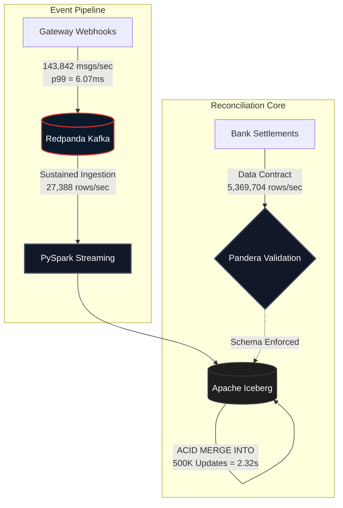
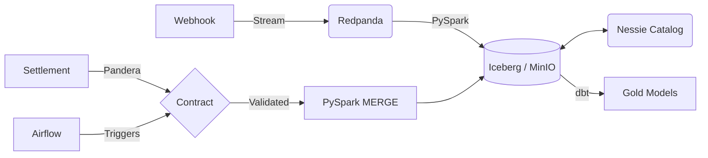

<div align="center">


> **A high-performance local data lakehouse designed to automate financial reconciliation at scale.**

  
  

</div>

`tx-recon` is a streaming reconciliation engine. It matches real-time payment gateway webhooks against delayed batch bank settlement files to verify Merchant Discount Rates (MDR), flag fee discrepancies instantly, and ensure mathematically sound financial settlement.

<table width="100%">
  <tr>
    <td width="50%">
      <h3>Sub-10ms Streaming</h3>
      <p>High-throughput ingestion via Redpanda and PySpark. Handles spikes effortlessly.</p>
    </td>
    <td width="50%">
      <h3>Strict Data Contracts</h3>
      <p>Pandera schemas prevent malformed settlements from touching the data lake.</p>
    </td>
  </tr>
  <tr>
    <td width="50%">
      <h3>ACID Lakehouse</h3>
      <p>Row-level upserts handled via Apache Iceberg <code>MERGE</code>. No partition overwrites.</p>
    </td>
    <td width="50%">
      <h3>Integer Finance Math</h3>
      <p>Guaranteed precision by storing all monetary amounts as strictly typed integer paise.</p>
    </td>
  </tr>
</table>

---

## Performance Velocity

> [!NOTE]
> Local dev benchmarks. Run <kbd>python tests/performance/run_benchmarks.py --suite all</kbd> to reproduce.
> *Hardware: 28 cores. Producer, Ingestion, and Pandera ran on native Windows 11. Iceberg MERGE ran inside a Linux Docker container (due to PySpark Python worker limitations).*



<details>
<summary><b>View Benchmark Deep Dives</b></summary>
<br>

- [Kafka Producer (20K → 130K+ msgs/sec)](docs/kafka_benchmark_explained.md)
- [PySpark Streaming Ingestion](docs/pyspark_ingestion_benchmark_explained.md)
- [Iceberg MERGE Reconciliation](docs/iceberg_merge_benchmark_explained.md)
- [Pandera vs Manual vs Pydantic Validation](docs/pandera_validation_benchmark_explained.md)
</details>

---

## How It Works

`tx-recon` replaces fragile end-of-month manual diffing with a robust, automated pipeline. 

```diff
- Manual Excel VLOOKUP matching at month-end
- Floating point precision loss in fee calculation
- O(N) full table overwrites on updates
+ Real-time stream-to-batch JOIN via Iceberg
+ Strict integer (paise) math validation
+ O(1) row-level mutation with MERGE INTO
```

### The Data Flow
1. **Gateway Webhook**: `{"transaction_id": "tx_8f92j", "gateway_fee_paise": 2000}` (Streamed via Redpanda)
2. **Bank Settlement**: `tx_8f92j,98000,2000` (Batch CSV validated via Pandera)
3. **The Engine**: PySpark executes a programmatic `MERGE INTO` Iceberg query to reconcile the two.

```sql
MERGE INTO lakehouse.reconciliation AS target
USING validated_settlements AS source
ON target.transaction_id = source.transaction_id
WHEN MATCHED AND target.gateway_fee_paise = source.bank_fee_paise 
  THEN UPDATE SET status = 'MATCHED'
WHEN MATCHED 
  THEN UPDATE SET status = 'EXCEPTION_FEE_MISMATCH'
```

---

<details>
<summary><b>View Architecture & Cloud Equivalents</b></summary>
<br>



| Local Component | Cloud Equivalent | Notes |
| :--- | :--- | :--- |
| Redpanda (Docker) | Amazon MSK / Confluent Cloud | Same Kafka API; managed brokers |
| MinIO (Docker) | Amazon S3 / GCS | S3-compatible object storage |
| Nessie (Docker) | AWS Glue Data Catalog / Unity Catalog | Git-like branching for Iceberg |
| PySpark on Docker | EMR / Dataproc | Managed Spark clusters |
| Airflow on Docker | MWAA / Cloud Composer | Managed Airflow |

</details>

<details>
<summary><b>View Project Structure & ADRs</b></summary>
<br>

| ADR | Decision | Status |
| :--- | :--- | :--- |
| [ADR-001](docs/ADR-001-PySpark-over-DuckDB.md) | PySpark over DuckDB for Spark-native Iceberg MERGE | Accepted |
| [ADR-002](docs/ADR-002-Iceberg-Lakehouse.md) | Iceberg lakehouse with Nessie catalog | Accepted |
| [ADR-003](docs/ADR-003-Testing-and-CICD-Strategy.md) | Testing and CI/CD strategy | Accepted |
| [ADR-004](docs/ADR-004-Terraform-IaC.md) | Terraform for infrastructure-as-code | Accepted |

```text
├── dags/                  # Airflow DAG definitions
├── src/                   
│   ├── common/            # Shared utilities (Spark session management)
│   ├── generators/        # Mock data generation (webhooks, settlements)
│   ├── ingestion/         # PySpark streaming pipelines
│   ├── processing/        # Batch processing (MERGE INTO logic)
│   └── validation/        # Data quality checks (Pandera validation)
├── tests/                 
│   ├── integration/       # External services testing (Kafka Testcontainers)
│   └── performance/       # pytest-benchmark performance suite
├── dbt_recon/             # dbt project for star schema modeling
├── infra/                 # Terraform configurations for AWS
└── docker-compose.yml     # Local infrastructure setup
```
</details>

---

## Quick Start

> [!TIP]
> Ensure Docker Desktop is running before executing the setup script.

1. Configure the virtual environment: 
   <kbd>.\setup.ps1</kbd>
2. Start the local infrastructure: 
   <kbd>docker-compose up -d --build</kbd>
3. Start the mock webhook generator: 
   <kbd>python src/generators/webhook_producer.py</kbd>
4. Start the PySpark streaming ingestion: 
   <kbd>python src/ingestion/ingest_webhooks.py</kbd>
5. Access Airflow UI at `http://localhost:8080` (admin/admin) to trigger the DAG.
