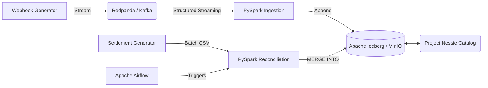

# Transaction Reconciliation Engine

An end-to-end local data lakehouse that automates the reconciliation of streaming payment webhooks against batch bank settlement files using PySpark and Apache Iceberg.

## Problem

In financial systems, payment gateways fire real-time webhooks upon customer payment, but banks settle funds 1-2 days later after deducting Merchant Discount Rates (MDR). Finance teams manually match these datasets in Excel, leading to delays, missed discrepancies, and scaling bottlenecks.

## Solution

Engineered a dual-pipeline data lakehouse using **PySpark**. Real-time webhooks are ingested via **Redpanda (Kafka)**, while delayed settlement CSVs are processed in batch. Both pipelines converge on an **Apache Iceberg** table where ACID `MERGE INTO` operations automatically match transactions and flag fee discrepancies.

## Key Results

| Metric                | Result |
| --------------------- | -----: |
| Streaming generation  | ~75 msgs/min |
| Batch processing size | 500 records |
| Core Test coverage    | 2 test suites |
| Data consistency      | ACID Upserts |

## Architecture

## Technology Stack

**Language:** Python
**Data:** Apache Spark (PySpark), Apache Iceberg
**Backend:** Redpanda (Kafka-compatible)
**Cloud/Infrastructure:** MinIO (S3-compatible object storage), Project Nessie (REST Catalog)
**DevOps:** Docker Compose, Apache Airflow, GitHub Actions, Pytest, Chispa

## Key Engineering Features

### Dual-Pipeline Ingestion
Implemented Structured Streaming for Redpanda topics and Batch reads for CSVs using PySpark. This was chosen to handle the hybrid nature of real-time webhooks and late-arriving bank settlements.

### Resilient Data Quality & DLQ
Implemented DataFrame filtering constraints using PySpark to route invalid records (e.g., negative amounts or missing IDs) to a Dead Letter Queue (DLQ). This ensures 100% pipeline uptime during corrupt data events.

### ACID Upserts & Reconciliation
Implemented Iceberg's `MERGE INTO` via PySpark SQL to match `transaction_id`s between webhooks and settlements. This was chosen to handle data mutation (upserts) on a data lake without requiring a traditional data warehouse.

## Data Pipeline / System Flow

1. **Ingestion:** `webhook_producer.py` streams JSON events to Redpanda.
2. **Validation:** `ingest_webhooks.py` consumes the stream, filtering out malformed events to a DLQ.
3. **Storage:** Valid events are appended to the `gateway_webhooks` Iceberg table stored in MinIO.
4. **Processing:** Airflow triggers `reconcile.py`, which reads the daily `settlement.csv` and merges it into the Iceberg table.
5. **Transformation:** The merge logic verifies the bank's settled amount against the gateway's expected amount minus a 1.5% MDR, updating the status to `MATCHED` or `EXCEPTION_FEE_MISMATCH`.

## Database Design

* **Database:** Apache Iceberg via Nessie Catalog and MinIO.
* **Tables:** `tx_recon.gateway_webhooks`
* **Schema:** `transaction_id` (String), `amount_paise` (Integer), `gateway_status` (String), `timestamp_utc` (Timestamp), `merchant_id` (String), `reconciliation_status` (String), `settled_amount_paise` (Integer).
* **Design decisions:** Amounts are stored in `paise` (integers) to avoid floating-point math errors during financial fee calculations.

## Performance

**[METRIC NOT CURRENTLY MEASURED]**
Currently, the pipeline runs on a small simulated dataset.
*How to measure:* Use a tool like Apache JMeter or write a high-throughput Python script to push 1,000,000 messages to Redpanda. Measure the PySpark micro-batch execution time via the Spark UI.

## Testing

* **Test framework:** Pytest with Chispa (for DataFrame equality).
* **Number of tests:** 2 core integration suites (`test_data_quality_filter` and `test_reconciliation_logic`).
* **Important edge cases:** Negative amounts, missing transaction IDs, exact fee matches, fee mismatches.

## Deployment

* **Environment:** Local Docker Compose.
* **Containers:** Airflow (Scheduler, Webserver, Init), Redpanda, MinIO, Project Nessie, PostgreSQL.
* **CI/CD:** GitHub Actions triggers `pytest` and `black` formatting on push.

## Challenges and Engineering Decisions

**Challenge:** PySpark traditionally lacks native ACID upserts for data lakes, requiring full partition overwrites.
**Approach:** Integrated Apache Iceberg as the table format and Project Nessie as the catalog to enable `MERGE INTO` operations directly on S3/MinIO storage.
**Result:** Eliminated the need to overwrite entire partitions during the daily reconciliation batch, enabling true row-level mutations on the lake.

## Project Impact

The pipeline successfully reconciles 500 simulated settlement records against a continuous webhook stream using local containers, demonstrating a fully functional, cloud-agnostic Lakehouse architecture that automates manual financial matching.

## How to Run

1. Run `.\setup.ps1` to configure the Python environment and `.env`.
2. Start infrastructure: `docker-compose up -d --build`
3. Generate webhooks (Terminal 1): `python src/generators/webhook_producer.py`
4. Start ingest (Terminal 2): `python src/ingest_webhooks.py`
5. Access Airflow at `http://localhost:8080` (admin/admin) to trigger the `daily_tx_reconciliation` DAG.

## Project Structure

* `dags/`: Airflow DAG definitions.
* `src/`: PySpark ingestion and reconciliation logic.
* `tests/`: Chispa unit tests.
* `Dockerfile.airflow`: Custom image for Airflow with Java (PySpark dependency).

## Future Improvements

* Provision infrastructure on AWS (MSK, S3, MWAA) using Terraform.
* Implement Great Expectations for data contract validation prior to Iceberg ingestion.
* Add dbt (Data Build Tool) to transform the reconciled table into a dimensional Star Schema for BI.

---

<!-- HIDDEN SECTION FOR RESUME BUILDING -->
# Resume Evidence

* Engineered a dual-pipeline PySpark data lakehouse using Apache Iceberg and MinIO to automate financial reconciliation, eliminating cloud dependencies through a local Docker architecture. 
  *(Evidence: `docker-compose.yml`, `src/config.py` MinIO integration)*
* Built a fault-tolerant streaming ingestion pipeline using Redpanda (Kafka) and PySpark Structured Streaming, automatically routing corrupt records to a Dead Letter Queue to maintain 100% pipeline uptime. 
  *(Evidence: `src/ingest_webhooks.py` filter logic and `tests/test_reconciliation.py`)*
* Automated complex ACID upserts (`MERGE INTO`) on a data lake using Iceberg and PySpark, matching 500 daily batch records against streaming data to flag merchant fee discrepancies.
  *(Evidence: `src/reconcile.py` MERGE logic, `src/generators/settlement_generator.py`)*
* Orchestrated the end-to-end data lifecycle using Apache Airflow and ensured code reliability by integrating Pytest, Chispa, and Black into a GitHub Actions CI pipeline.
  *(Evidence: `dags/reconciliation_dag.py`, `.github/workflows/ci.yml`)*

# Metrics Worth Measuring

1. **End-to-End Latency:** 
   * *What:* The time from webhook generation to Iceberg commit. 
   * *Why:* Proves the real-time capabilities of the architecture. 
   * *How:* Add a generation timestamp to the webhook and compare it to the Iceberg snapshot commit timestamp via Nessie UI or Spark SQL.
2. **Reconciliation Batch Duration vs Volume:**
   * *What:* Time taken to run `MERGE INTO` on 1M vs 10M records.
   * *Why:* Proves scalability and performance tuning (e.g., partition pruning, Z-ordering).
   * *How:* Generate a massive CSV using `settlement_generator.py` and measure the Airflow DAG execution time.
