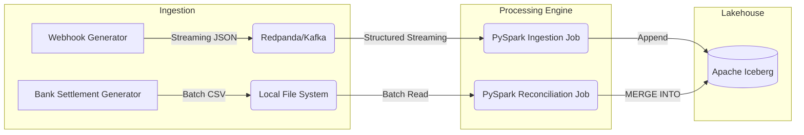

# Transaction Reconciliation Engine

An end-to-end data pipeline that reconciles real-time payment gateway webhooks against delayed bank settlement files. Built with PySpark, Apache Iceberg, and Redpanda (Kafka).

## The Problem
When a customer pays, the gateway fires a webhook. But the bank doesn't actually deposit the money for 1-2 days, and when they do, they deduct a flat fee (MDR). Finance teams waste hours manually matching these records in Excel to find missing funds.

This project automates that matching process at scale.

## Architecture



## Tech Stack
* **Stream Ingestion:** Redpanda (Kafka compatible)
* **Processing:** Apache Spark (PySpark)
* **Storage:** Apache Iceberg (Lakehouse format)
* **Infrastructure:** Docker Compose

## Getting Started (Windows)

Since Windows doesn't come with `make` by default, run the included setup script from PowerShell:

1. Open PowerShell in this directory.
2. Run the setup script to create a virtual environment, install dependencies, and start the Docker containers:
   ```powershell
   .\setup.ps1
   ```
3. Generate mock webhook data (simulating gateway traffic):
   ```powershell
   python src/generators/webhook_producer.py
   ```
4. In a new terminal (with the `.venv` activated), start the streaming ingestion job:
   ```powershell
   .\.venv\Scripts\Activate.ps1
   python src/ingest_webhooks.py
   ```
5. Generate a delayed bank settlement CSV and run the batch reconciliation:
   ```powershell
   .\.venv\Scripts\Activate.ps1
   python src/generators/settlement_generator.py
   python src/reconcile.py
   ```
