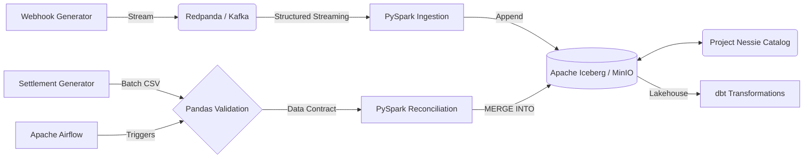

<div align="center">


> **A high-performance local data lakehouse designed to automate financial reconciliation at scale.**

  
  

</div>

**The Problem:** Finance teams manually match real-time payment gateway webhooks against delayed batch bank settlement files to verify Merchant Discount Rates (MDR) and settle funds. This manual process causes month-end delays and masks revenue leakage.

**The Solution:** This engine automates the matching process. By leveraging a robust, scalable architecture, it flags fee discrepancies instantly and ensures mathematically sound reconciliation.

---

## Technology Stack

| Component | Technology | Description |
| :--- | :--- | :--- |
| **Data Processing** |  | Distributed computation & stream processing |
| **Streaming** |  | High-throughput message broker (Redpanda) |
| **Storage Layer** |  | Open table format for the data lake |
| **Orchestration** |  | DAG scheduling and dependency management |
| **Data Modeling** |  | Analytics engineering & dimensional modeling |
| **Validation** |  | Strict data contracts via Pandera |
| **Infrastructure** |   | IaC and Containerization |
| **CI/CD** |  | Automated testing and benchmark reporting |

---

## Performance

> [!NOTE]
> Local dev benchmarks. Run `python tests/performance/run_benchmarks.py --suite all` to reproduce.

### Headline Numbers

| Metric | Result |
| :--- | :--- |
| **Producer Throughput** | `143,842 msgs/sec` (acks=all, lz4 compression) |
| **Producer Ack Latency** | `p50=2.06 ms`, `p95=5.12 ms`, `p99=6.07 ms` |
| **Ingestion Rate** | `27,388 rows/sec` sustained (Kafka → Iceberg) |
| **Iceberg MERGE (500K, 50% update)** | `2.32s` write, `0.05s` read |
| **Pandera Validation** | `5,369,704 rows/sec` (1M rows, schema validation) |
| **Test Coverage** | `93%` (Mocked PySpark & Kafka for Windows) |

*Benchmarks run on Windows 11, 28 cores, Python 3.13. Producer, Ingestion, and Pandera validations ran on native Windows. Iceberg MERGE benchmarks ran inside a Linux Docker container (due to PySpark Python worker limitations on Windows).*

**Deep dives on each benchmark:**
- [Kafka Producer (20K → 130K+ msgs/sec)](docs/kafka_benchmark_explained.md)
- [PySpark Streaming Ingestion](docs/pyspark_ingestion_benchmark_explained.md)
- [Iceberg MERGE Reconciliation](docs/iceberg_merge_benchmark_explained.md)
- [Pandera vs Manual vs Pydantic Validation](docs/pandera_validation_benchmark_explained.md)

### Scaling Characteristics

| Scale | MERGE Write | MERGE Read |
| :--- | :--- | :--- |
| 500K rows, 50% update | 2.32s | 0.05s |
| 2M rows, 50% update | 4.28s | 0.05s |

### Reproduce

For a detailed step-by-step guide, see [How to Run Benchmarks](docs/how_to_benchmark.md).

```bash
# Run all benchmarks (requires docker-compose up -d)
python tests/performance/run_benchmarks.py --suite all

# Kafka producer only
python tests/performance/kafka_producer_benchmark.py --count 1000000 --mode both

# Pandera validation only (no Docker needed)
python tests/performance/pandas_validation_benchmark.py --rows 1000000
```

Results are written to `tests/performance/results.json` with hardware specs, latency percentiles, and structured output.

---

## Architecture



---

## Cloud Equivalents

| Local Component | Cloud Equivalent | Notes |
| :--- | :--- | :--- |
| Redpanda (Docker) | Amazon MSK / Confluent Cloud | Same Kafka API; managed brokers |
| MinIO (Docker) | Amazon S3 / GCS | S3-compatible object storage |
| Nessie (Docker) | AWS Glue Data Catalog / Unity Catalog | Git-like branching for Iceberg |
| PySpark on Docker | EMR / Dataproc | Managed Spark clusters |
| Airflow on Docker | MWAA / Cloud Composer | Managed Airflow |

---

## How It Works

1. **Ingestion:** `webhook_producer.py` streams JSON events to Redpanda.
2. **Validation:** `ingest_webhooks.py` consumes the stream, filtering malformed events to a Dead Letter Queue (DLQ).
3. **Storage:** Valid events are appended to the `gateway_webhooks` Iceberg table stored in MinIO.
4. **Data Contract:** Airflow triggers `validate_settlement.py`, verifying the daily `settlement.csv` against strict rules.
5. **Processing:** Airflow triggers `reconcile.py`, merging the validated settlement data into the Iceberg table.
6. **Reconciliation:** The logic matches `transaction_id`, verifies the bank's settled amount against the expected amount, and updates the status to `MATCHED` or `EXCEPTION_FEE_MISMATCH`.

---

## Engineering Decisions

- **Streaming Constraints:** Implemented PySpark Structured Streaming to read JSON events from Redpanda, enforcing DataFrame API constraints to prevent bad data from crashing the pipeline.
- **Strict Data Contracts:** Integrated native Pandas validation (via Pandera) into the Airflow DAG to validate daily settlement files *before* they touch the data lake.
- **ACID Upserts:** Utilized Iceberg's `MERGE INTO` via PySpark SQL to handle data mutation. This enables row-level updates when bank settlements arrive, avoiding full partition overwrites.
- **Integer Math for Finance:** Monetary amounts are strictly stored in `paise` (integers) to avoid floating-point arithmetic errors during fee reconciliation.

---

## Architecture Decision Records

| ADR | Decision | Status |
| :--- | :--- | :--- |
| [ADR-001](docs/ADR-001-PySpark-over-DuckDB.md) | PySpark over DuckDB for Spark-native Iceberg MERGE | Accepted |
| [ADR-002](docs/ADR-002-Iceberg-Lakehouse.md) | Iceberg lakehouse with Nessie catalog | Accepted |
| [ADR-003](docs/ADR-003-Testing-and-CICD-Strategy.md) | Testing and CI/CD strategy | Accepted |
| [ADR-004](docs/ADR-004-Terraform-IaC.md) | Terraform for infrastructure-as-code | Accepted |

---

## Trade-offs

| Choice | Alternative | Why This Choice |
| :--- | :--- | :--- |
| PySpark + Iceberg | DuckDB | MERGE INTO requires Spark-native Iceberg support |
| Redpanda | Kafka | Same API, faster local dev, single binary |
| Pandera | Great Expectations | Lightweight, dataframe-native, no server needed |
| dbt for gold layer | Raw SQL | Version control, testing, documentation built-in |
| Docker Compose | K8s | Local dev simplicity, no cluster overhead |

---

## Project Structure

```text
├── dags/                  # Airflow DAG definitions
├── src/                   
│   ├── common/            # Shared utilities (Spark session management)
│   ├── generators/        # Mock data generation (webhooks, settlements)
│   ├── ingestion/         # PySpark streaming pipelines
│   ├── processing/        # Batch processing (MERGE INTO logic)
│   └── validation/        # Data quality checks (Pandera validation)
├── tests/                 
│   ├── integration/       # External services testing (Kafka Testcontainers)
│   └── performance/       # pytest-benchmark performance suite
├── dbt_recon/             # dbt project for star schema modeling
├── infra/                 # Terraform configurations for AWS
└── docker-compose.yml     # Local infrastructure setup
```

---

## Setup & Usage

> [!TIP]
> Ensure Docker Desktop is running before executing the setup script.

1. Configure the virtual environment: 
   ```powershell
   .\setup.ps1
   ```
2. Start the local infrastructure: 
   ```bash
   docker-compose up -d --build
   ```
3. Start the mock webhook generator: 
   ```bash
   python src/generators/webhook_producer.py
   ```
4. Start the PySpark streaming ingestion: 
   ```bash
   python src/ingestion/ingest_webhooks.py
   ```
5. Access the Airflow UI at `http://localhost:8080` (admin/admin) to trigger the `daily_tx_reconciliation` DAG.

---

## Future Improvements

| Priority | Item | Description |
| :--- | :--- | :--- |
| P0 | Grafana dashboard | Real-time reconciliation metrics and alerting |
| P0 | Dead Letter Queue monitoring | Alert on DLQ depth exceeding threshold |
| P1 | Schema registry integration | Enforce Avro/JSON schema evolution via Redpanda Schema Registry |
| P1 | Delta Lake migration path | Evaluate Iceberg vs Delta for Databricks compatibility |
| P2 | Multi-tenant support | Isolate merchant data with row-level security |
| P2 | Cost estimation | Per-query cost tracking for Iceberg snapshots |
| P3 | Cross-region replication | Iceberg table replication for DR |
| P3 | ML anomaly detection | Detect unusual fee patterns automatically |
