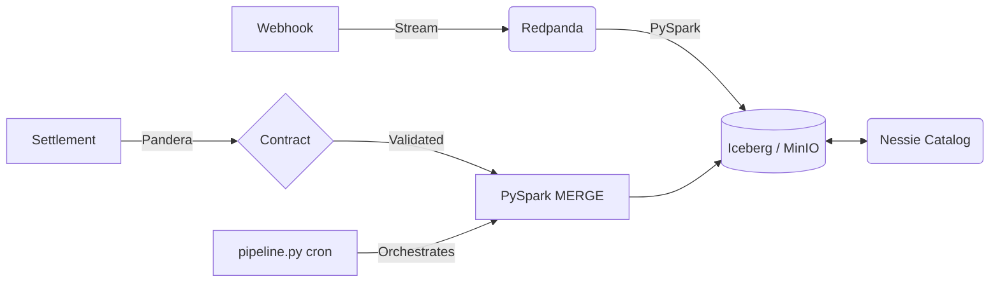

<div align="center">


# Transaction Reconciliation

Local lakehouse that reconciles payment gateway webhooks against bank settlement files.

[](https://github.com/DhanushPillay/tx-recon/actions/workflows/ci.yml)
[](https://www.python.org)

</div>

**The problem:** every online payment creates two records — the gateway's webhook ("we collected ₹1,000") and, days later, the bank's settlement file ("we settled ₹976.40"). The gap is the Merchant Discount Rate (MDR, the gateway's cut) plus GST (tax) on that fee. Finance teams match these by hand to catch overcharging and delayed closes.

**The solution:** a pipeline that streams webhooks into an Iceberg table, validates the daily settlement CSV, and joins the two with an Iceberg MERGE that marks each payment MATCHED, fee mismatch, or missing.

A worked example from the default rate card (`config/fee_rates.yaml`): a ₹1,000 (100,000 paise) credit card payment carries 2% MDR (₹20) plus 18% GST on the fee (₹3.60), so the expected settlement is ₹976.40. A settlement of ₹976.40 reconciles; ₹970.00 raises `EXCEPTION_FEE_MISMATCH`.

> **Scope:** local proof of concept on Docker with synthetic data — not a production system. Benchmarks are single-node only.

---

## Architecture



| Local component | Production equivalent |
| :--- | :--- |
| Redpanda (Docker) | Amazon MSK / Confluent Cloud |
| MinIO (Docker) | Amazon S3 / GCS |
| Nessie (Docker) | AWS Glue Data Catalog |
| PySpark on Docker | EMR / Dataproc |
| pipeline.py on cron | MWAA / Cloud Composer |

> `dags/` keeps the original Airflow DAG as reference. The lean local runner is
> `python -m src.pipeline` (cron or systemd); Airflow/MWAA is the scale-up path.

## Features

- Instrument-aware fees from `config/fee_rates.yaml`, computed in integer paise to avoid float drift (`src/processing/fee_engine.py`)
- GST on MDR per instrument, with optional per-merchant negotiated rates
- Iceberg MERGE upsert on `transaction_id`, including `WHEN NOT MATCHED` handling for settlements with no webhook (`src/processing/reconcile.py`)
- Pandera contracts (strict types, uniqueness, real calendar-date check) with bad rows isolated to `quarantine_*.csv` (`src/validation/validate_settlement.py`)
- Dead-letter queue table for malformed webhooks (`src/ingestion/ingest_webhooks.py`)
- Sealed accuracy harness reporting precision, recall, F1, and per-break-class recall (`tests/performance/recon_accuracy.py`)
- Regression gate that fails a PR on >15% throughput drop (`tests/performance/check_regression.py`)

## Tech stack

Python 3.11 · PySpark 3.5.1 · Apache Iceberg · Project Nessie · Redpanda · MinIO · Trino · Pandera · Airflow 2.11.2

## Installation

```bash
# 1. Configure environment
cp .env.example .env
# set MINIO_ROOT_PASSWORD in .env — compose fails without it
# Windows: copy .env.example .env

# 2. Start infrastructure
docker compose up -d

# 3. Create virtual environment and install
python -m venv .venv
.venv/Scripts/pip install -e ".[dev]"
# macOS/Linux: .venv/bin/pip install -e ".[dev]"

# 4. Verify
ruff check src/ tests/ dags/
pytest tests/ -m "not integration" -v
```

## Usage

```bash
# 10-second accuracy gate, no infra needed — writes tests/performance/results_accuracy.json
make demo
# or
python tests/performance/quick_perf.py

# Full pipeline for a date (needs Docker services up)
python -m src.pipeline --date 2026-09-04

# Generate a settlement file, then validate it
python src/generators/settlement_generator.py
python src/validation/validate_settlement.py

# Run tests
pytest tests/ -m "not integration" -v   # unit only
pytest tests/ -m integration -v         # needs Redpanda/MinIO/Nessie
```

## Benchmarks

Correctness first — a fast wrong match corrupts the ledger. Throughput numbers are single-machine; full method, commands, and environment are in `docs/BENCHMARKS.md`.

| Suite | What is measured | Result (this repo) |
| :--- | :--- | :--- |
| Accuracy (sealed key) | Precision, recall, F1, false positives on injected `EXACT / ROUNDING / FEE_MISMATCH / ORPHAN / DUPLICATE / OUT_OF_ORDER / LATE_CORRECTION` | `min_f1=1.0, FP=0` @ 2000 rows x 3 seeds (42, 7, 123). Per-class recall 1.0. Source: `tests/performance/results_accuracy.json` |
| Kafka producer | Async msgs/sec + serial flush p50/p95/p99 | **135,091 msgs/sec** async; **p50 0.76ms / p95 1.07ms / p99 1.72ms** serial flush. Config `acks=all`, lz4, 1KB records, 5000 warmup + 5000 measured + 1000 serial, Redpanda `localhost:19092`. Latency is a single sample, not a repeated median |
| Validation | In-memory rows/sec (Pandera vs manual pandas vs Polars vs Pydantic) | Pandera 1.0M rows/sec @10k, 2.8M @1M. Polars 2.3M @10k, 19.0M @1M. Pydantic row loop is 5x slower. See `results_pandera.json` |
| Iceberg MERGE | Median write sec and rows/sec at 100k rows | **10% update:** 1.28s median, 7,822 rows/sec, **50% update:** 1.36s median, 36,887 rows/sec. `SPARK_MODE=local`, healthy, 4 repeats. Source: `results_iceberg.json`. Larger scales not yet measured |

```bash
# Reproduce the gate
python tests/performance/quick_perf.py

# Reproduce all suites (needs Docker; small counts for quick run)
python tests/performance/run_benchmarks.py --suite pandera
python tests/performance/run_benchmarks.py --suite iceberg
python tests/performance/kafka_producer_benchmark.py --count 5000 --acks all --compression lz4
```

## Configuration

All settings live in `src/common/settings.py` (via `pydantic-settings`) and load from `.env`. Key variables:

| Variable | Default | Purpose |
| :--- | :--- | :--- |
| `MINIO_ROOT_PASSWORD` | `change-me` | MinIO password (**required** — compose fails without it) |
| `MINIO_ENDPOINT` | `http://localhost:9000` | S3 endpoint |
| `MINIO_ACCESS_KEY` / `MINIO_SECRET_KEY` | | S3 credentials |
| `NESSIE_HOST` / `NESSIE_PORT` | `localhost` / `19120` | Catalog connection |
| `KAFKA_BROKER` | `localhost:19092` | Redpanda broker |
| `TOPIC_NAME` | `gateway_webhooks` | Webhook topic |
| `SPARK_MODE` | `local` | `local` or `cluster` |
| `FEE_RATE_CONFIG` | `config/fee_rates.yaml` | Fee card path |

Full table: [`docs/LOCAL_SETUP.md`](docs/LOCAL_SETUP.md).

## Project Structure

```text
├── dags/                    # Airflow DAG (reference; lean runner is src/pipeline.py)
├── src/
│   ├── common/              # Settings, Spark session, domain contracts
│   ├── generators/          # Webhook producer + settlement generator
│   ├── ingestion/           # Spark streaming Kafka -> Iceberg (+DLQ)
│   ├── processing/          # FeeEngine + MERGE reconciliation
│   ├── validation/          # Pandera contracts + quarantine
│   └── pipeline.py          # generate -> validate -> reconcile (cron entrypoint)
├── tests/
│   ├── processing/          # Fee engine (unit + property) + reconcile logic
│   ├── validation/          # Schema validation tests
│   ├── performance/         # Accuracy harness + throughput benchmarks
│   └── common/              # Config tests
└── docker-compose.yml       # Redpanda + MinIO + Nessie
```

## Contributing

Keep changes small and add a test for new behavior.

```bash
ruff format src/ tests/ dags/ && ruff check src/ tests/ dags/
pytest tests/ -m "not integration" --cov=src --cov-fail-under=70
```

See `.github/PULL_REQUEST_TEMPLATE.md` for the PR checklist.
