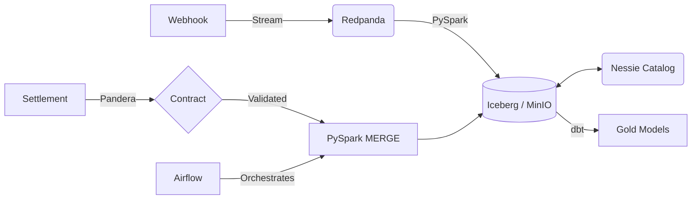

<div align="center">

# tx-recon

> **A local data lakehouse for payment gateway reconciliation — correct by construction.**


</div>

**The Problem:** Finance teams manually match payment gateway webhooks against delayed bank settlement files to verify Merchant Discount Rates (MDR). This manual process causes month-end delays and masks revenue leakage.

**The Solution:** An automated pipeline that reconciles real-time webhooks against batch settlements using Iceberg MERGE, with instrument-aware fee calculation and configurable rate cards.

---

## What This Is (and Isn't)

**This is:**
- A working local proof-of-concept for streaming + batch reconciliation
- A demonstration of Iceberg MERGE for incremental updates
- A reference architecture for payment reconciliation
- A portfolio project with honest benchmarks

**This is NOT:**
- Production-ready — it runs on Docker Compose, not a Spark cluster
- A payments system — it processes synthetic data, not real money
- Scalable to billions of transactions — benchmarks are single-node only

---

## Architecture



| Local Component | Cloud Equivalent |
| :--- | :--- |
| Redpanda (Docker) | Amazon MSK / Confluent Cloud |
| MinIO (Docker) | Amazon S3 / GCS |
| Nessie (Docker) | AWS Glue Data Catalog |
| PySpark on Docker | EMR / Dataproc |
| Airflow on Docker | MWAA / Cloud Composer |

---

## Key Features

| Feature | Implementation |
| :--- | :--- |
| **Instrument-aware fees** | YAML-driven rate cards per instrument type (UPI, CC, DC, etc.) |
| **GST on MDR** | Automatic GST calculation on the MDR fee |
| **Rounding tolerance** | Configurable tolerance for minor rounding differences |
| **ACID MERGE** | Iceberg MERGE INTO with WHEN NOT MATCHED handling |
| **Data contracts** | Pandera schemas with strict type + uniqueness checks |
| **Quarantine** | Invalid records isolated, not dropped |
| **Dead Letter Queue** | Failed webhook records captured in separate Iceberg table |
| **dbt star schema** | fact_reconciliations + dim_merchant + dim_date + dim_instrument |

---

## Quick Start

```bash
# 1. Start infrastructure
docker compose up -d

# 2. Run the full pipeline via Airflow
# Airflow UI: http://localhost:8080 (admin/admin)
# DAG: daily_tx_reconciliation

# 3. Or run individual steps manually
python src/generators/settlement_generator.py
python src/validation/validate_settlement.py
python src/ingestion/ingest_webhooks.py
```

---

## Benchmarks

> [!WARNING]
> These are local Docker benchmarks on a single machine. They do NOT represent production multi-node performance. See [Benchmark Methodology](docs/how_to_benchmark.md) for details.

| Benchmark | Result | Environment |
| :--- | :--- | :--- |
| Kafka Producer Throughput | ~130K msgs/sec (acks=1, lz4) | Local Docker |
| Pandera Validation | ~5M rows/sec (1M rows) | Native Windows |
| Iceberg MERGE (500K, 50% update) | ~2.3s write | Docker container |
| PySpark Streaming Ingestion | ~27K rows/sec | Docker container |

**Caveats:**
- Single-node, not distributed
- No network latency (all localhost)
- No real message ordering guarantees
- Benchmarks run on developer hardware (28 cores)

For detailed explanations: [Kafka](docs/kafka_benchmark_explained.md) | [PySpark](docs/pyspark_ingestion_benchmark_explained.md) | [Iceberg](docs/iceberg_merge_benchmark_explained.md) | [Pandera](docs/pandera_validation_benchmark_explained.md)

---

## Configuration

All configuration is centralized in `src/common/settings.py` using `pydantic-settings`. Values load from `.env` + environment overrides.

Fee rates are configured in `config/fee_rates.yaml`:
```yaml
instruments:
  UPI:
    mdr_rate_bps: 0
    gst_on_mdr: 0
  CREDIT_CARD:
    mdr_rate_bps: 200  # 2.0%
    gst_on_mdr: 18.0
```

See [`.env.example`](.env.example) for available environment variables.

---

## Project Structure

```text
├── config/                  # Fee rate configuration
├── dags/                    # Airflow DAG definitions
├── src/
│   ├── common/              # Settings and Spark session management
│   ├── generators/          # Mock data generation (webhooks, settlements)
│   ├── ingestion/           # PySpark streaming pipelines
│   ├── processing/          # Fee engine + MERGE reconciliation
│   └── validation/          # Pandera data contracts
├── tests/
│   ├── processing/          # Fee engine + reconciliation unit tests
│   ├── validation/          # Schema validation tests
│   ├── integration/         # Kafka Testcontainers tests
│   └── performance/         # Benchmarks
├── dbt_recon/               # dbt star schema models
├── infra/                   # Terraform (placeholder for AWS)
├── docs/                    # ADRs + benchmark explainers
└── docker-compose.yml       # Local infrastructure
```

---

## ADRs

| ADR | Decision | Status |
| :--- | :--- | :--- |
| [ADR-001](docs/ADR-001-PySpark-over-DuckDB.md) | PySpark over DuckDB | Accepted |
| [ADR-002](docs/ADR-002-Iceberg-Lakehouse.md) | Iceberg lakehouse with Nessie | Accepted |
| [ADR-003](docs/ADR-003-Testing-and-CICD-Strategy.md) | Testing and CI/CD strategy | Accepted |
| [ADR-004](docs/ADR-004-Terraform-IaC.md) | Terraform for AWS deployment | Accepted |
| [ADR-005](docs/ADR-005-Fee-Engine.md) | Configurable fee engine with rate cards | Accepted |
| [ADR-006](docs/ADR-006-Matching-Strategy.md) | Multi-status reconciliation strategy | Accepted |
