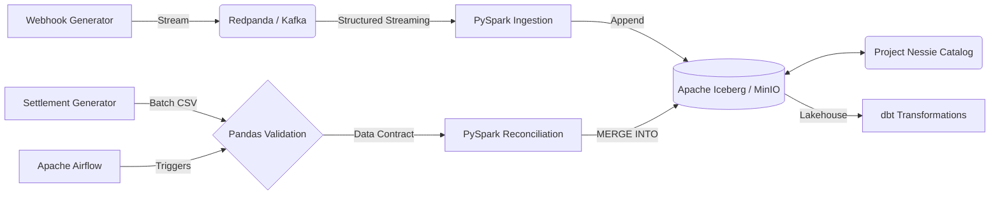

# Transaction Reconciliation Engine

> **A high-performance local data lakehouse designed to automate financial reconciliation at scale.**

**The Problem:** Finance teams typically manually match real-time payment gateway webhooks against delayed batch bank settlement files to verify Merchant Discount Rates (MDR) and settle funds. This manual process causes month-end delays and masks revenue leakage.

**The Solution:** This engine automates the matching process. By leveraging a robust, scalable architecture, it flags fee discrepancies instantly and ensures mathematically sound reconciliation.

---

## Technology Stack

| Component | Technology | Description |
| :--- | :--- | :--- |
| **Data Processing** |  | Distributed computation & stream processing |
| **Streaming** |  | High-throughput message broker (Redpanda) |
| **Storage Layer** |  | Open table format for the data lake |
| **Orchestration** |  | DAG scheduling and dependency management |
| **Data Modeling** |  | Analytics engineering & dimensional modeling |
| **Validation** |  | Strict data contracts via Pandera |
| **Infrastructure** |   | IaC and Containerization |
| **CI/CD** |  | Automated testing and benchmark reporting |

---

## Key Results

> [!NOTE]  
> Local dev benchmarks (Intel i7-14700K, 28 cores, 16GB RAM, Windows 11). Run `python tests/performance/run_benchmarks.py` to reproduce.

| Metric | Result |
| :--- | :--- |
| **Producer Throughput** | `25,414 msgs/sec` (acks=all, linger_ms=5) |
| **Producer Ack Latency** | `p50=15.6ms`, `p95=16.7ms`, `p99=17.2ms` |
| **Ingestion Rate** | `19,089 rows/sec` sustained (Kafka → Iceberg) |
| **Test Coverage** | `93%` (Mocked PySpark & Kafka for Windows natively) |

### Reproduce Benchmarks

```bash
# Kafka producer (throughput + ack latency)
python tests/performance/kafka_producer_benchmark.py --count 100000

# PySpark ingestion (sustained throughput)
python tests/performance/pyspark_ingestion_benchmark.py

# Iceberg MERGE (write time, read amplification)
python tests/performance/reconciliation_benchmark.py
```

*Results are written to `tests/performance/results.json` with hardware specs, latency percentiles, and structured output.*

---

## Architecture



---

## How It Works

1. **Ingestion:** `webhook_producer.py` streams JSON events to Redpanda.
2. **Validation:** `ingest_webhooks.py` consumes the stream, filtering malformed events to a Dead Letter Queue (DLQ).
3. **Storage:** Valid events are appended to the `gateway_webhooks` Iceberg table stored in MinIO.
4. **Data Contract:** Airflow triggers `validate_settlement.py`, verifying the daily `settlement.csv` against strict rules.
5. **Processing:** Airflow triggers `reconcile.py`, merging the validated settlement data into the Iceberg table.
6. **Reconciliation:** The logic matches `transaction_id`, verifies the bank's settled amount against the expected amount, and updates the status to `MATCHED` or `EXCEPTION_FEE_MISMATCH`.

---

## Engineering Decisions

- **Streaming Constraints:** Implemented PySpark Structured Streaming to read JSON events from Redpanda, enforcing DataFrame API constraints to prevent bad data from crashing the pipeline.
- **Strict Data Contracts:** Integrated native Pandas validation (via Pandera) into the Airflow DAG to validate daily settlement files *before* they touch the data lake.
- **ACID Upserts:** Utilized Iceberg's `MERGE INTO` via PySpark SQL to handle data mutation. This enables row-level updates when bank settlements arrive, avoiding full partition overwrites.
- **Integer Math for Finance:** Monetary amounts are strictly stored in `paise` (integers) to avoid floating-point arithmetic errors during fee reconciliation.

---

## Project Structure

```text
├── dags/                  # Airflow DAG definitions
├── src/                   
│   ├── common/            # Shared utilities (Spark session management)
│   ├── generators/        # Mock data generation (webhooks, settlements)
│   ├── ingestion/         # PySpark streaming pipelines
│   ├── processing/        # Batch processing (MERGE INTO logic)
│   └── validation/        # Data quality checks (Pandera validation)
├── tests/                 
│   ├── integration/       # External services testing (Kafka Testcontainers)
│   └── performance/       # pytest-benchmark performance suite
├── dbt_recon/             # dbt project for star schema modeling
├── infra/                 # Terraform configurations for AWS
└── docker-compose.yml     # Local infrastructure setup
```

---

## Setup & Usage

> [!TIP]
> Ensure Docker Desktop is running before executing the setup script.

1. Configure the virtual environment: 
   ```powershell
   .\setup.ps1
   ```
2. Start the local infrastructure: 
   ```bash
   docker-compose up -d --build
   ```
3. Start the mock webhook generator: 
   ```bash
   python src/generators/webhook_producer.py
   ```
4. Start the PySpark streaming ingestion: 
   ```bash
   python src/ingestion/ingest_webhooks.py
   ```
5. Access the Airflow UI at `http://localhost:8080` (admin/admin) to trigger the `daily_tx_reconciliation` DAG.
