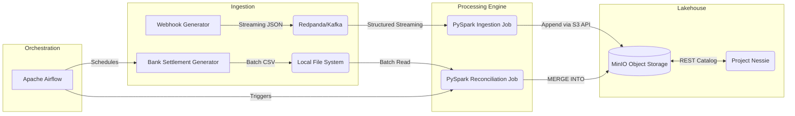

# Transaction Reconciliation Engine

An end-to-end data pipeline that reconciles real-time payment gateway webhooks against delayed bank settlement files. Built with PySpark, Apache Iceberg, Redpanda (Kafka), MinIO (S3), Project Nessie, and orchestrated with Apache Airflow.

## The Problem
When a customer pays, the gateway fires a webhook. But the bank doesn't actually deposit the money for 1-2 days, and when they do, they deduct a flat fee (MDR). Finance teams waste hours manually matching these records in Excel to find missing funds.

This project automates that matching process at scale.

## Architecture



## Tech Stack
* **Stream Ingestion:** Redpanda (Kafka compatible)
* **Processing & Data Quality:** Apache Spark (PySpark)
* **Storage:** Apache Iceberg + MinIO (S3 compatible)
* **Metastore / Catalog:** Project Nessie (Data as Code REST Catalog)
* **Orchestration:** Apache Airflow
* **Testing & CI/CD:** Pytest, Chispa, GitHub Actions
* **Infrastructure:** Docker Compose

## Getting Started (Windows)

1. Open PowerShell in this directory.
2. Run the setup script to create a virtual environment, install dependencies, and start the Docker containers:
   ```powershell
   .\setup.ps1
   ```
3. Generate mock webhook data (simulating gateway traffic):
   ```powershell
   python src/generators/webhook_producer.py
   ```
4. In a new terminal, start the streaming ingestion job. Valid records go to Iceberg, invalid ones go to a Dead Letter Queue (DLQ):
   ```powershell
   .\.venv\Scripts\Activate.ps1
   python src/ingest_webhooks.py
   ```
5. Log into Airflow at `http://localhost:8080` (admin/admin) and unpause the `daily_tx_reconciliation` DAG. The DAG will automatically generate a delayed bank settlement CSV and run the PySpark `MERGE INTO` batch reconciliation.

## Data Quality & Testing
* **Data Quality:** The ingestion pipeline includes native PySpark constraints to route malformed webhooks (negative amounts, missing IDs) to a Dead Letter Queue (DLQ).
* **Testing:** Run `pytest tests/` to execute the DataFrame equality tests (powered by Chispa). Tests are automatically run on push via GitHub Actions.

## Resume / Portfolio Highlights

This project was built to demonstrate production-grade Data Engineering skills. When adding this to your resume, you can highlight the following achievements:

* **Engineered an End-to-End Lakehouse:** Designed and deployed a local data lakehouse using **Apache Iceberg**, **MinIO (S3-compatible)**, and **Project Nessie** (REST catalog), bypassing expensive cloud costs while maintaining enterprise-level architecture.
* **Stream & Batch Processing Pipelines:** Built a dual-pipeline architecture using **PySpark**. Ingested real-time mock payment webhooks via **Redpanda (Kafka)** using Structured Streaming, and processed delayed, late-arriving bank settlement CSVs via Batch processing.
* **Data Quality & Dead Letter Queues (DLQ):** Implemented strict data validation constraints during ingestion. Corrupt or malformed records (e.g., missing IDs or negative amounts) are automatically filtered and routed to an Iceberg DLQ table without interrupting the main pipeline.
* **Complex Data Reconciliation:** Wrote PySpark jobs leveraging Iceberg's `MERGE INTO` capabilities to perform ACID upserts, successfully matching payments with settlements, and automatically flagging fee discrepancies as exceptions.
* **Workflow Orchestration & CI/CD:** Orchestrated the entire batch lifecycle (data generation & reconciliation) using **Apache Airflow** inside a custom Docker environment. Secured code reliability by integrating **Pytest** and **Chispa** into a **GitHub Actions** CI/CD pipeline.
