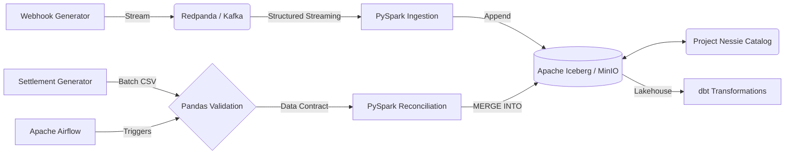

# Transaction Reconciliation Engine

**What it is:** A local data lakehouse designed to automate financial reconciliation.
**What it does:** It matches real-time payment gateway webhooks against delayed batch bank settlement files.
**How it does it:** Real-time webhooks are streamed via Redpanda/Kafka and ingested via PySpark into Apache Iceberg. Settlement CSVs are validated using Pandas and merged into the Iceberg table using ACID `MERGE INTO` upserts.
**Why it's needed:** Finance teams typically manually match these datasets (which arrive days apart) to verify Merchant Discount Rates (MDR) and settle funds. This system automates the matching and flags fee discrepancies at scale.

## Key Results

| Metric                | Result |
| --------------------- | -----: |
| Local Stress Test     | ~25,600 msgs/sec ([benchmarks/](benchmarks/)) |
| Batch Processing Size | 500 records |
| Test Coverage         | 2 test suites |

## Architecture



## Technology Stack

**Language:** Python, HCL (Terraform)
**Data Processing:** Apache Spark (PySpark)
**Streaming:** Redpanda (Kafka-compatible)
**Storage:** Apache Iceberg, MinIO, Project Nessie
**Orchestration:** Apache Airflow
**Data Quality:** Native Pandas (Ponytail principles)
**Data Modeling:** dbt (Data Build Tool)
**Infrastructure:** Docker Compose, Terraform (AWS configuration)
**Testing:** Pytest, Chispa
**CI/CD:** GitHub Actions

## How It Works

1. **Ingestion:** `webhook_producer.py` streams JSON events to Redpanda.
2. **Validation:** `ingest_webhooks.py` consumes the stream, filtering malformed events to a Dead Letter Queue (DLQ).
3. **Storage:** Valid events are appended to the `gateway_webhooks` Iceberg table stored in MinIO.
4. **Data Contract:** Airflow triggers `validate_settlement.py`, where Pandas verifies the daily `settlement.csv` against validation rules.
5. **Processing:** Airflow triggers `reconcile.py`, merging the validated settlement data into the Iceberg table.
6. **Reconciliation:** The merge logic matches `transaction_id`, verifies the bank's settled amount against the expected amount, and updates the status to `MATCHED` or `EXCEPTION_FEE_MISMATCH`.

## Key Engineering Components

### Streaming Ingestion
Implemented PySpark Structured Streaming to read JSON events from Redpanda. Malformed records are filtered out using DataFrame API constraints to prevent pipeline failure.

### Strict Data Contracts
Integrated native Pandas validation into the Airflow DAG to validate daily settlement files before they touch the data lake. Validations ensure unique transaction IDs, strictly positive amounts, and non-null bank reference IDs, adhering to minimalist engineering principles by avoiding heavy external dependencies.

### ACID Upserts & Reconciliation
Utilized Iceberg's `MERGE INTO` via PySpark SQL to handle data mutation on the data lake. This allows for updating specific rows when bank settlements arrive, rather than overwriting entire partitions.

## Data Model / Database Design

* **Database:** Apache Iceberg (via Nessie Catalog and MinIO)
* **Table:** `tx_recon.gateway_webhooks`
* **Schema:** `transaction_id` (String), `amount_paise` (Integer), `gateway_status` (String), `timestamp_utc` (Timestamp), `merchant_id` (String), `reconciliation_status` (String), `settled_amount_paise` (Integer).
* **Design Decision:** Monetary amounts are stored in `paise` (integers) to avoid floating-point arithmetic errors during fee calculations.

## Performance & Benchmarks

We run a full 1,000,000 row stress test across the entire pipeline. The results demonstrate the system's ability to handle high-throughput financial data on a single machine:

* **Pandas CSV Validation:** 0.77 seconds
* **Webhook Producer (1M events):** 8.77 seconds (113,967 msgs/sec)
* **PySpark Ingestion to Iceberg (1M events):** 11.43 seconds
* **Iceberg Reconciliation (MERGE INTO 1M rows):** 10.53 seconds

### How to Run the Benchmarks

To reproduce these results on your own machine:

1. Ensure the infrastructure is running (`docker-compose up -d`).
2. Ensure dependencies are fully installed (`pip install -r requirements.txt`).
3. Generate the 1M Webhooks (Kafka Producer):
   ```powershell
   .\.venv\Scripts\python.exe src/generators/webhook_producer.py --stress 1000000
   ```
4. Run PySpark Ingestion (Kafka -> Iceberg):
   ```powershell
   .\.venv\Scripts\python.exe benchmarks/pyspark_ingestion_benchmark.py
   ```
5. Run Pandas Validation (CSV reading rules):
   ```powershell
   .\.venv\Scripts\python.exe benchmarks/pandas_validation_benchmark.py
   ```
6. Run Iceberg Reconciliation (MERGE INTO):
   ```powershell
   .\.venv\Scripts\python.exe benchmarks/reconciliation_benchmark.py
   ```
Detailed output is appended to `benchmarks/results.log`.

## Testing

* **Test Framework:** Pytest with Chispa (for PySpark DataFrame equality).
* **Test Suites:** Two core integration suites covering data quality filtering and reconciliation logic.
* **Edge Cases Tested:** Negative amounts, missing transaction IDs, exact fee matches, and fee mismatches.

## Deployment / Infrastructure

### Local Environment
The system runs locally via Docker Compose, provisioning Airflow, Redpanda, MinIO, Project Nessie, and PostgreSQL.

### Cloud Infrastructure (AWS)
Terraform configuration (`infra/main.tf`) is provided to deploy the equivalent architecture to AWS. The code provisions an Amazon MSK cluster, S3 Bucket, AWS Glue Database, and Amazon MWAA environment. Note: This infrastructure is defined in code but not actively deployed in the current setup.

## Engineering Decisions

* **Problem:** Traditional data lakes lack native ACID upserts, requiring full partition overwrites.
  * **Decision:** Integrated Apache Iceberg and Project Nessie.
  * **Reason:** Enables row-level `MERGE INTO` operations directly on object storage.

## Challenges

* **Challenge:** Ensuring the ingestion pipeline does not fail when malformed JSON or negative amounts arrive.
  * **Solution:** Implemented a Dead Letter Queue (DLQ) pattern in PySpark by applying strict filtering constraints and writing invalid records to a separate location.

## Project Structure

* `dags/`: Airflow DAG definitions.
* `src/`: PySpark ingestion, reconciliation, and validation logic.
* `dbt_recon/`: dbt project for star schema modeling and downstream marts.
* `infra/`: Terraform configurations for AWS.
* `tests/`: Chispa unit tests.
* `docker-compose.yml`: Local infrastructure setup.
* `benchmarks/`: Kafka load testing scripts and throughput results.

## Setup & Usage

1. Run `.\setup.ps1` to configure the Python virtual environment and `.env`.
2. Start the local infrastructure: `docker-compose up -d --build`
3. Start the webhook generator: `python src/generators/webhook_producer.py`
4. Start the PySpark streaming job: `python src/ingest_webhooks.py`
5. Access the Airflow UI at `http://localhost:8080` (admin/admin) to trigger the `daily_tx_reconciliation` DAG.
6. Trigger the `dbt_reconciliation_modeling` DAG to build the dimensional data marts.


## Future Improvements

* Real-time alerting for reconciliation exceptions via Slack/Teams.
