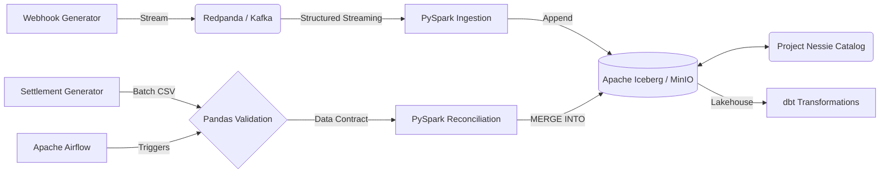

# Transaction Reconciliation Engine

A local data lakehouse that reconciles streaming payment webhooks against batch bank settlement files using PySpark and Apache Iceberg.

## Problem

In financial systems, payment gateways fire real-time webhooks upon customer payment, but banks settle funds 1-2 days later after deducting Merchant Discount Rates (MDR). Finance teams often manually match these datasets, leading to delays and scaling bottlenecks.

## Solution

Implemented a dual-pipeline data lakehouse using PySpark. Real-time webhooks are ingested via Redpanda (Kafka), while delayed settlement CSVs are processed in batch. Both pipelines converge on an Apache Iceberg table where `MERGE INTO` operations automatically match transactions and flag fee discrepancies.

## Key Results

| Metric                | Result |
| --------------------- | -----: |
| Local Stress Test     | ~20,000 msgs/sec |
| Batch Processing Size | 500 records |
| Test Coverage         | 2 test suites |

## Architecture

## Technology Stack

**Language:** Python, HCL (Terraform)
**Data Processing:** Apache Spark (PySpark)
**Streaming:** Redpanda (Kafka-compatible)
**Storage:** Apache Iceberg, MinIO, Project Nessie
**Orchestration:** Apache Airflow
**Data Quality:** Native Pandas (Ponytail principles)
**Data Modeling:** dbt (Data Build Tool)
**Infrastructure:** Docker Compose, Terraform (AWS configuration)
**Testing:** Pytest, Chispa
**CI/CD:** GitHub Actions

## How It Works

1. **Ingestion:** `webhook_producer.py` streams JSON events to Redpanda.
2. **Validation:** `ingest_webhooks.py` consumes the stream, filtering malformed events to a Dead Letter Queue (DLQ).
3. **Storage:** Valid events are appended to the `gateway_webhooks` Iceberg table stored in MinIO.
4. **Data Contract:** Airflow triggers `validate_settlement.py`, where Pandas verifies the daily `settlement.csv` against validation rules.
5. **Processing:** Airflow triggers `reconcile.py`, merging the validated settlement data into the Iceberg table.
6. **Reconciliation:** The merge logic matches `transaction_id`, verifies the bank's settled amount against the expected amount, and updates the status to `MATCHED` or `EXCEPTION_FEE_MISMATCH`.

## Key Engineering Components

### Streaming Ingestion
Implemented PySpark Structured Streaming to read JSON events from Redpanda. Malformed records are filtered out using DataFrame API constraints to prevent pipeline failure.

### Strict Data Contracts
Integrated native Pandas validation into the Airflow DAG to validate daily settlement files before they touch the data lake. Validations ensure unique transaction IDs, strictly positive amounts, and non-null bank reference IDs, adhering to minimalist engineering principles by avoiding heavy external dependencies.

### ACID Upserts & Reconciliation
Utilized Iceberg's `MERGE INTO` via PySpark SQL to handle data mutation on the data lake. This allows for updating specific rows when bank settlements arrive, rather than overwriting entire partitions.

## Data Model / Database Design

* **Database:** Apache Iceberg (via Nessie Catalog and MinIO)
* **Table:** `tx_recon.gateway_webhooks`
* **Schema:** `transaction_id` (String), `amount_paise` (Integer), `gateway_status` (String), `timestamp_utc` (Timestamp), `merchant_id` (String), `reconciliation_status` (String), `settled_amount_paise` (Integer).
* **Design Decision:** Monetary amounts are stored in `paise` (integers) to avoid floating-point arithmetic errors during fee calculations.

## Performance

A local stress test processed 10,000 events in 0.50 seconds (~20,000 events/sec). This was measured by removing sleep delays from the `webhook_producer.py` generator and logging the elapsed time during message production to Redpanda.

## Testing

* **Test Framework:** Pytest with Chispa (for PySpark DataFrame equality).
* **Test Suites:** Two core integration suites covering data quality filtering and reconciliation logic.
* **Edge Cases Tested:** Negative amounts, missing transaction IDs, exact fee matches, and fee mismatches.

## Deployment / Infrastructure

### Local Environment
The system runs locally via Docker Compose, provisioning Airflow, Redpanda, MinIO, Project Nessie, and PostgreSQL.

### Cloud Infrastructure (AWS)
Terraform configuration (`infra/main.tf`) is provided to deploy the equivalent architecture to AWS. The code provisions an Amazon MSK cluster, S3 Bucket, AWS Glue Database, and Amazon MWAA environment. Note: This infrastructure is defined in code but not actively deployed in the current setup.

## Engineering Decisions

* **Problem:** Traditional data lakes lack native ACID upserts, requiring full partition overwrites.
  * **Decision:** Integrated Apache Iceberg and Project Nessie.
  * **Reason:** Enables row-level `MERGE INTO` operations directly on object storage.

## Challenges

* **Challenge:** Ensuring the ingestion pipeline does not fail when malformed JSON or negative amounts arrive.
  * **Solution:** Implemented a Dead Letter Queue (DLQ) pattern in PySpark by applying strict filtering constraints and writing invalid records to a separate location.

## Project Structure

* `dags/`: Airflow DAG definitions.
* `src/`: PySpark ingestion, reconciliation, and validation logic.
* `dbt_recon/`: dbt project for star schema modeling and downstream marts.
* `infra/`: Terraform configurations for AWS.
* `tests/`: Chispa unit tests.
* `docker-compose.yml`: Local infrastructure setup.

## Setup & Usage

1. Run `.\setup.ps1` to configure the Python virtual environment and `.env`.
2. Start the local infrastructure: `docker-compose up -d --build`
3. Start the webhook generator: `python src/generators/webhook_producer.py`
4. Start the PySpark streaming job: `python src/ingest_webhooks.py`
5. Access the Airflow UI at `http://localhost:8080` (admin/admin) to trigger the `daily_tx_reconciliation` DAG.
6. Trigger the `dbt_reconciliation_modeling` DAG to build the dimensional data marts.

## Future Improvements

* Real-time alerting for reconciliation exceptions via Slack/Teams.
