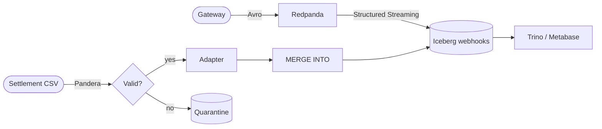

<div align="center">


# Transaction Reconciliation

Local lakehouse pipeline that matches payment gateway webhooks against bank settlement files.

[](https://github.com/DhanushPillay/tx-recon/actions/workflows/ci.yml)
[](https://www.python.org)

</div>

## What this is

A pipeline that solves one problem: the gateway says it collected Rs.X, the bank says it settled Rs.Y, and the difference should equal the fee (MDR + GST). If it does not, something needs investigation.

**The problem in numbers:** every online payment creates two records, the gateway's webhook ("we collected Rs.1,000") and the bank's settlement file days later ("we settled Rs.976.40"). The gap is the Merchant Discount Rate (MDR, the gateway's cut) plus GST on that fee. Finance teams match these by hand to catch overcharging and delayed closes.

**How tx-recon works:** it streams webhooks into an Iceberg table, validates the daily settlement CSV, and joins the two with an Iceberg MERGE that marks each payment as MATCHED, EXCEPTION_FEE_MISMATCH, or EXCEPTION_MISSING_WEBHOOK.

## Worked example

A Rs.1,000 (100,000 paise) credit card payment at the default rate (`config/fee_rates.yaml`):

```
fee_before_gst = (100000 * 200 + 5000) // 10000 = 2000   (Rs.20, 2% MDR)
gst_paise      = (2000 * 1800 + 5000) // 10000   = 360    (Rs.3.60, 18% GST on fee)
net_paise      = 100000 - 2360                     = 97640  (Rs.976.40)
```

If the settlement file says Rs.976.40, the transaction is `MATCHED`. If it says Rs.970.00, it is `EXCEPTION_FEE_MISMATCH`. If there is no webhook for that transaction, it is `EXCEPTION_MISSING_WEBHOOK`.

## Architecture



Two paths converge on one table. The streaming path ingests webhooks continuously. The batch path merges settlements daily. Both use idempotent MERGE so re-runs are safe.

Full architecture: [docs/ARCHITECTURE.md](docs/ARCHITECTURE.md).

## Features

- Integer-only paise math in both Python and Spark SQL, no floating-point drift (`src/processing/fee_engine.py`)
- Versioned rate cards with effective-date ranges so historical settlements use the rates that were active when they settled (`config/fee_rates.yaml`)
- Per-merchant negotiated rates that override instrument rates within each card
- Merchant-aware MERGE SQL that checks `merchant_id` before `instrument_type`
- PG settlement adapters that normalize Razorpay, Cashfree, and PayU CSVs to a canonical 12-column shape (`src/adapters/settlement.py`)
- Pandera contract validation with quarantine of bad rows before they reach Spark
- Streaming dedup via `dropDuplicates` + `MERGE WHEN NOT MATCHED` in `foreachBatch`
- Downgrade-only residual scorer with a formal proof that false positives never increase (`docs/PROOF.md`)
- Sealed accuracy harness that injects 7 break classes and asserts F1=1.0 with zero false positives (`tests/performance/recon_accuracy.py`)

## Quick start

Prerequisites: Docker, Python 3.11, Java 17.

```bash
# 1. Clone
git clone https://github.com/DhanushPillay/tx-recon.git
cd tx-recon

# 2. Configure environment
cp .env.example .env
# Edit .env: set MINIO_ROOT_PASSWORD (docker compose fails without it)

# 3. Start infrastructure
docker compose up -d

# 4. Create venv and install
python -m venv .venv
.venv/Scripts/pip install -e ".[dev]"
# macOS/Linux: .venv/bin/pip install -e ".[dev]"

# 5. Run the accuracy gate (no infra needed)
make demo
# or: python tests/performance/quick_perf.py

# 6. Run the full pipeline (needs Docker)
python -m src.pipeline --date 2026-09-04
```

Full setup guide: [docs/LOCAL_SETUP.md](docs/LOCAL_SETUP.md).

## Benchmarks

Single-node local numbers. Full method and repro commands: [docs/BENCHMARKS.md](docs/BENCHMARKS.md).

| Suite | Result |
| :--- | :--- |
| Accuracy (sealed key) | `min_f1=1.0, FP=0` @ 2000 rows x 3 seeds |
| Kafka producer | **135,091 msgs/sec** async; serial flush p99 1.72ms (acks=all, lz4, 1KB) |
| Validation (Pandera) | **2.8M rows/sec** @ 1M rows (in-memory) |
| Iceberg MERGE | **36,887 rows/sec** @ 100k rows, 50% update (4 repeats, median) |

## Project structure

```
src/
  adapters/        PG settlement normalizers (Razorpay, Cashfree, PayU, Generic)
  common/          Settings, Spark session, domain contracts
  generators/      Webhook producer + settlement file generator
  ingestion/       Spark streaming Kafka -> Iceberg (+DLQ)
  processing/      FeeEngine + MERGE reconciliation + residual scorer
  validation/      Pandera schemas + quarantine
  pipeline.py      generate -> validate -> reconcile (cron entrypoint)
```

## Contributing

Keep changes small and add a test for new behavior.

```bash
ruff format src/ tests/ dags/ && ruff check src/ tests/ dags/
pytest tests/ -m "not integration" --cov=src --cov-fail-under=70
```

See `.github/PULL_REQUEST_TEMPLATE.md` for the PR checklist.
