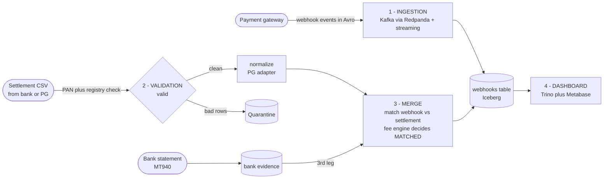
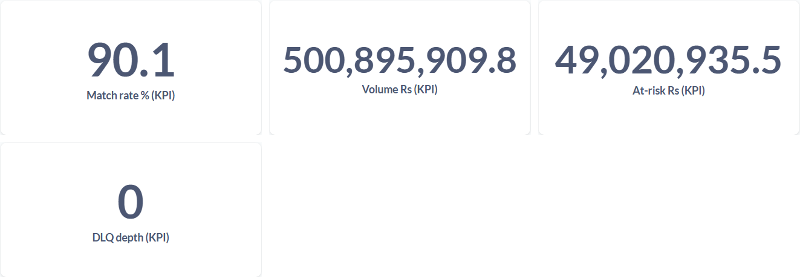
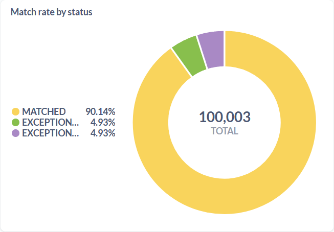

<div align="center">


# Transaction Reconciliation

Local lakehouse pipeline that matches payment gateway webhooks against bank settlement files.

[](https://github.com/DhanushPillay/tx-recon/actions/workflows/ci.yml)
[](https://codecov.io/gh/DhanushPillay/tx-recon)
[](https://www.python.org)
[](LICENSE)

</div>

## What this is

A pipeline that solves one problem: the gateway says it collected Rs.X, the bank says it settled Rs.Y, and the difference should equal the fee (MDR + GST). If it does not, something needs investigation.

**The problem in numbers:** every online payment creates two records, the gateway's webhook ("we collected Rs.1,000") and the bank's settlement file days later ("we settled Rs.976.40"). The gap is the Merchant Discount Rate (MDR, the gateway's cut) plus GST on that fee. Finance teams match these by hand to catch overcharging and delayed closes.

**How tx-recon works:** it streams webhooks into an Iceberg table, validates the daily settlement CSV, and joins the two with an Iceberg MERGE that marks each payment as MATCHED, EXCEPTION_FEE_MISMATCH, or EXCEPTION_MISSING_WEBHOOK.

## Worked example

A Rs.1,000 (100,000 paise) credit card payment at the default rate (`config/fee_rates.yaml`):

```
fee_before_gst = (100000 * 200 + 5000) // 10000 = 2000   (Rs.20, 2% MDR)
gst_paise      = (2000 * 1800 + 5000) // 10000   = 360    (Rs.3.60, 18% GST on fee)
net_paise      = 100000 - 2360                     = 97640  (Rs.976.40)
```

If the settlement file says Rs.976.40, the transaction is `MATCHED`. If it says Rs.970.00, it is `EXCEPTION_FEE_MISMATCH`. If there is no webhook for that transaction, it is `EXCEPTION_MISSING_WEBHOOK`.

## Quickstart

```bash
cp .env.example .env          # set MINIO_ROOT_PASSWORD
docker compose up -d          # redpanda, minio, nessie, trino, metabase
pip install -e ".[dev]"
python -m src.pipeline --date 2026-09-04
```

Then query the reconciled table via Trino (`http://localhost:8080`) or
Metabase (`http://localhost:3001`, add Trino: host `trino`, port `8080`,
catalog `nessie`, schema `db`). Full setup: [docs/LOCAL_SETUP.md](docs/LOCAL_SETUP.md).

## Architecture



Single node (0$): `SPARK_MODE=local` (`local[*]`, host driver + MinIO/Nessie/Redpanda/Trino via `docker compose up -d`). Terraform `infra/terraform/local` (LocalStack) proves cloud IaC without bill; same code deploys to `infra/terraform` (S3+Glue, KMS, lifecycle).

Three legs converge on one table. Streaming ingests webhooks (bucket(16, transaction_id) to co-locate MERGE joins). Batch validates settlements (PAN guard + content-hash registry → WAP branch) and merges by provider batch, not calendar date. The bank leg (MT940 via `mt-940`) provides independent evidence for MATCHED rows — a gateway-consistent error is invisible without it. All merges are idempotent so re-runs converge.

Full architecture: [docs/ARCHITECTURE.md](docs/ARCHITECTURE.md).

## Features

- Integer-only paise math in both Python and Spark SQL, no floating-point drift (`src/processing/fee_engine.py`)
- Versioned rate cards with effective-date ranges so historical settlements use the rates that were active when they settled (`config/fee_rates.yaml`)
- Per-merchant negotiated rates that override instrument rates within each card
- Merchant-aware MERGE SQL that checks `merchant_id` before `instrument_type` (`src/processing/reconcile.py: build_fee_case_sql`)
- PG settlement adapters that normalize Razorpay, Cashfree, and PayU CSVs to a canonical 13-column shape including `provider` (`src/adapters/settlement.py`, `config/providers.yaml`)
- Provider batch identity + per-provider lag/SLA (`config/providers.yaml`, `src/processing/batches.py`) — reconcile by `{provider}:{batch_date}` with `lag_days`/`late_sla_days`, not calendar date
- Bank-statement third leg: MT940 parsing via `mt-940` (never hand-rolled) with independent credit evidence for MATCHED rows (`src/adapters/bank_statement.py`, `EXCEPTION_MISSING_BANK_STATEMENT`)
- Pandera contract validation with quarantine + no-PAN gate (Luhn-checked scan) + content-hash file registry before Spark (`src/validation/pan_guard.py`, `file_registry.py`)
- WAP branches (`src/processing/wap.py`): batches land on `ingest/YYYY-MM-DD`, merge to `main` only on gate pass (`spark.wap.branch` + `write.wap.enabled` both required, verified live against Nessie 0.107.9 API v2)
- Bucket partitioning `PARTITIONED BY bucket(16, transaction_id)` + `WRITE ORDERED BY transaction_id` so MERGE prunes to file groups (`src/ingestion/ingest_webhooks.py: ensure_webhook_table`)
- Streaming dedup via `dropDuplicates` + idempotent `MERGE WHEN NOT MATCHED` in `foreachBatch` with watermark-bounded state and schema-id drift detection
- Append-only corrections journal with maker-checker (`src/processing/corrections.py`, `scripts/replay_dlq.py --reason/--approved-by`)
- Strict fail-closed defaults (`strict_slo`, `REQUIRE_KAFKA_SASL`, `REQUIRE_SCHEMA_REGISTRY`, `ALLOW_DESTRUCTIVE_SEED`) — real-data seeding is opt-in
- Downgrade-only residual scorer with a formal proof that false positives never increase (`docs/PROOF.md`)
- Real-data accuracy gate: 10k sample joined through `FeeEngine.check_match`, match_rate >= 85% (`tests/performance/recon_accuracy.py`, measured 94.6%)

## Dashboard

Trino serves the reconciled Iceberg tables; Metabase visualizes them.
BI-ready mart: [sql/marts/fact_reconciliation.sql](sql/marts/fact_reconciliation.sql).

```sql
SELECT status, COUNT(*), SUM(amount_paise) / 100.0 AS rupees
FROM nessie.db.webhooks
GROUP BY status;
```




Full tour of all 11 cards: [docs/DASHBOARD.md](docs/DASHBOARD.md).

## Benchmarks

Measured on real data: [thiru1711/Financial_Transactions](https://huggingface.co/datasets/thiru1711/Financial_Transactions)
(13,305,915 card transactions) on 25 Sep 2026. Method, repro commands, and full tables: [docs/REAL_DATA.md](docs/REAL_DATA.md).

| Suite | Result |
| :--- | :--- |
| Iceberg MERGE (single-node, 8g driver, 128 shuffles ≥5M) | 1M 50% **13.25s**, 5M 50% **11.61s**, 12M 50% **56.73s** (10%: 6.0 / 6.83 / 10.32s; bench slices ~94.7% due to tx-ordered sampling; end-to-end 89.98% — see below) |
| Validation, 12.9M rows | polars **9.43M** / manual 3.34M / pandera 763k / pydantic 178k rows/sec |
| Kafka producer (real ~150B records, acks=all, lz4) | **225,123 msgs/sec**; serial p50 0.65ms, p99 3.97ms |
| End-to-end batch (12.6M rows: validate + MERGE + mart) | **~5 min wall** (173s validate, 105s MERGE, 89.98% end-to-end) |

Record: `tests/performance/results_real.json`. The loader injects ~10% exceptions by design (health gate ≥ 85%): bench slices show ~94.7% due to tx-ordered sampling, while the full 12.6M end-to-end run reports **89.98%** (11,368,871 / 12,635,227) — both are the mix working, not matcher error.
Synthetic regression baselines are archived in [docs/BENCHMARKS.md](docs/BENCHMARKS.md).

## Project structure

```
src/
  adapters/        PG settlement normalizers (Razorpay/Cashfree/PayU/Generic) + bank_statement MT940 + real_data loader
  common/          Settings (strict flags, *_FILE secrets), Spark session, domain contracts
  ingestion/       Spark streaming Kafka -> Iceberg (+DLQ, WAP table layout, bucket 16)
  processing/      FeeEngine + MERGE reconciliation + residual scorer + batches (provider windows) + wap (branches) + corrections (journal)
  validation/      Pandera schemas + quarantine + pan_guard (Luhn) + file_registry (sha256)
  pipeline.py      validate (PAN/registry) -> reconcile (provider batch) -> metrics + maintenance (real data only, fail-closed)
config/
  fee_rates.yaml   versioned rate cards (effective_from/to, merchant overrides)
  providers.yaml   per-provider lag_days / late_sla_days / cutoff
sql/marts/         fact_reconciliation mart (migrations/V*__fact_reconciliation.sql is source of truth)
```

## Contributing

See [CONTRIBUTING.md](CONTRIBUTING.md). Security policy: [SECURITY.md](SECURITY.md).
PR checklist: `.github/PULL_REQUEST_TEMPLATE.md`.

## Roadmap

- Production Kubernetes manifest (the `k8s/` stub was removed; compose is the supported path).

Shipped: `fact_reconciliation` TABLE mart (migration-sourced), DLQ replay with maker-checker
(`scripts/replay_dlq.py --reason --approved-by`), match-rate SLO (`MATCH_RATE_SLO` strict fail-closed),
per-provider late SLA (`LATE_SLA_DAYS` → `config/providers.yaml` per-provider `late_sla_days` → `LATE_UNRESOLVED`),
bucket(16) partitioning, WAP branches (`src/processing/wap.py`), bank third leg (MT940 via `mt-940` → `EXCEPTION_MISSING_BANK_STATEMENT`),
PAN guard + file registry, `provider` canonical column, bucketed maintenance order (expire → orphan 3d → binpack → manifests),
real-data scale proof (12.6M, 91.7% coverage). CI: `pip-audit` blocking with 92 ignores (all pip-only locals).

## License

MIT — see [LICENSE](LICENSE).
