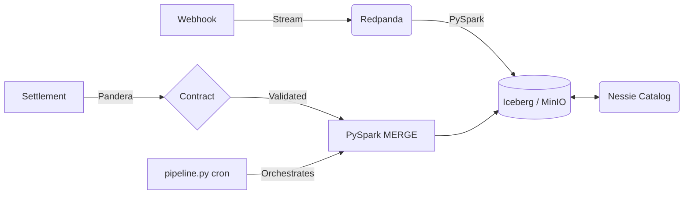

<div align="center">


# Transaction Reconciliation

> **A local data lakehouse for payment gateway reconciliation, correct by construction.**


</div>

**The Problem:** Finance teams manually match payment gateway webhooks against delayed bank settlement files to verify Merchant Discount Rates (MDR). This manual process causes month-end delays and masks revenue leakage.

**The Solution:** An automated pipeline that reconciles real-time webhooks against batch settlements using Iceberg MERGE, with instrument-aware fee calculation and configurable rate cards.

---

## What This Is (and Isn't)

**This is:**
- A working local proof-of-concept for streaming + batch reconciliation
- A demonstration of Iceberg MERGE for incremental updates
- A reference architecture for payment reconciliation

**This is NOT:**
- Production-ready — it runs on Docker Compose, not a Spark cluster
- A payments system — it processes synthetic data, not real money
- Scalable to billions of transactions — benchmarks are single-node only

---

## Architecture



> `dags/` keeps the original Airflow DAG as reference. The lean local runner is
> `python -m src.pipeline` (cron/systemd); Airflow/MWAA is the scale-up path.

| Local Component | Cloud Equivalent |
| :--- | :--- |
| Redpanda (Docker) | Amazon MSK / Confluent Cloud |
| MinIO (Docker) | Amazon S3 / GCS |
| Nessie (Docker) | AWS Glue Data Catalog |
| PySpark on Docker | EMR / Dataproc |
| pipeline.py on cron | MWAA / Cloud Composer |

---

## Key Features

| Feature | Implementation |
| :--- | :--- |
| **Instrument-aware fees** | Configurable via `config/fee_rates.yaml`, with canonical Python `fee_engine.py` that translates logic to Spark SQL for MERGE |
| **GST on MDR** | Automatic GST calculation on the MDR fee per instrument and merchant tier |
| **ACID MERGE** | Iceberg MERGE INTO with WHEN NOT MATCHED handling |
| **Data contracts** | Pandera schemas with strict type + uniqueness checks |
| **Quarantine** | Invalid records isolated, not dropped |
| **Dead Letter Queue** | Failed webhook records captured in separate Iceberg table |

---

## Design decisions

| Decision | Why |
| :--- | :--- |
| Iceberg MERGE on `transaction_id` | ACID upsert: re-runs converge instead of duplicating; late corrections UPDATE in place |
| Integer paise, no floats | Floats round; money must not. The Spark SQL uses integer `DIV` mirroring FeeEngine exactly |
| One FeeEngine, SQL generated from it | Single source of truth; a golden test pins SQL == Python across instruments and edge amounts |
| Pandera at the batch boundary + quarantine | Write-Audit-Publish: bad rows isolate to `quarantine_*.csv` / DLQ instead of crashing the pipeline |
| `pipeline.py` on cron, Airflow DAG as reference | Lean local runner; MWAA/Composer is the scale-up path, not a second implementation |

---

## Quick Start

```bash
# 1. Start infrastructure (Redpanda + MinIO + Nessie)
docker compose up -d

# 2. Run the full pipeline (cron replacement for the Airflow DAG)
python -m src.pipeline --date 2026-09-04

# 3. Or run individual steps manually
python src/generators/settlement_generator.py
python src/validation/validate_settlement.py
```

---

## Benchmarking

We measure throughput, latency, **correctness**, and validation overhead —
correctness first (a fast wrong match is silent ledger corruption).

| Suite | Script | What it measures |
| :--- | :--- | :--- |
| Accuracy (sealed key) | `tests/performance/recon_accuracy.py` | Precision/recall/F1 + per-break recall + FP count on injected EXACT / ROUNDING / FEE_MISMATCH / ORPHAN / DUPLICATE / OUT_OF_ORDER / LATE_CORRECTION breaks. Answer key never touches the matcher. Gate: `test_recon_accuracy.py` (P=R=F1=1.0, FP=0 @500 rows ×2 seeds, plus @2000 rows for rare classes). |
| Kafka producer | `kafka_producer_benchmark.py` | msgs/sec, ack latency p50/p95/p99 |
| Spark streaming | `pyspark_ingestion_benchmark.py` | sustained rows/sec, batch duration |
| Iceberg MERGE | `reconciliation_benchmark.py` | write/read sec, **rows/sec**, file counts, matched/mismatched @100K/500K/1M/2M/5M |
| Validation | `pandas_validation_benchmark.py` | rows/sec: Pandera vs manual pandas vs pydantic vs Polars |
| Regression gate | `check_regression.py` | fails PR if throughput drops >15% or p99 rises >20% vs baseline; warns (not fails) when the hardware fingerprint differs so a new machine isn't mistaken for a slowdown |
| Quick gate (no infra) | `quick_perf.py` / `make demo` | sealed accuracy harness @2000 rows ×3 seeds + hardware fingerprint; writes `results.json` for the regression gate |

```bash
# Ensure infrastructure is up
docker compose up -d

# 10-second signal, no infra needed (accuracy harness + machine fingerprint)
make demo

# Accuracy gate (no infra needed) + unit tests
pytest tests/performance/test_recon_accuracy.py tests/processing/test_fee_engine.py -v

# Full benchmark suite (needs Redpanda/MinIO/Nessie)
pytest tests/performance/ -v
```

### Measured results

Environment (measured September 2026): Windows 11, 28 cores, 15.8GB RAM,
Python 3.13.5, Redpanda/MinIO/Nessie via Docker, JDK 17 for Spark.
Source of truth: `tests/performance/results.json`.

**Accuracy (sealed key — answer key never touches the matcher):**

| Scale | Precision | Recall | F1 | False positives |
| :--- | :--- | :--- | :--- | :--- |
| 2,000 rows | 1.0 | 1.0 | 1.0 | 0 |
| 10,000 rows | 1.0 | 1.0 | 1.0 | 0 |

Per-class recall is 1.0 across MATCHED / FEE_MISMATCH / MISSING_WEBHOOK.

**Kafka producer (`acks=all`, lz4 — strongest durability):**
142,188 msgs/sec, p50 0.78ms / p95 4.03ms / p99 7.53ms
(2,000-message run, 1KB records).
(The script used to default to weaker `acks=1`; it now defaults to `acks=all`
so the number you reproduce matches the number published.)

**Validation bake-off @100K rows (measured; lower time is better):**

| Method | Time | Throughput |
| :--- | :--- | :--- |
| Manual pandas | 8.94ms | ~11.2M rows/sec |
| Polars | 64.71ms | ~1.5M rows/sec |
| Pandera | 88.63ms | ~1.1M rows/sec |
| Pydantic | 220.29ms | ~454K rows/sec |

Takeaway: manual pandas is fastest at this scale; Pandera costs ~10x for the
declarative contract — worth it at the batch boundary. (An earlier table
quoting 10M-row runs was retired: those runs were never reproduced on this
box.)

> Spark streaming + Iceberg MERGE throughput suites are not yet run on this
> box: the Spark/Iceberg path was broken (stale JAVA_HOME/SPARK_HOME,
> unpublished Maven artifacts) and is now fixed — a live Spark→Nessie→MinIO
> probe passes (create/insert/count/drop). Full scale runs are pending; those
> suites also run in CI on Linux (see `.github/workflows/ci.yml`).
> Older MERGE figures were generated with a pre-GST fee formula and are retired,
> not repeated.

Scaling curves measure whether MERGE degrades sub-linearly, linearly, or
exponentially. Merge-on-Read is typically sub-linear on write but degrades reads
over time, necessitating compaction (`write.target-file-size-bytes=256MB`, zstd).

Data quality follows Write-Audit-Publish: Pandera contracts validate at the
batch boundary, failures quarantine to `quarantine_*.csv` / `webhooks_dlq`
instead of crashing the pipeline.

---

## Configuration

All configuration is centralized in `src/common/settings.py` using `pydantic-settings`. Values load from `.env` + environment overrides.

---

## Project Structure

```text
├── dags/                    # Airflow DAG (reference; lean runner is src/pipeline.py)
├── src/
│   ├── common/              # Settings, Spark session, domain contracts
│   ├── generators/          # Webhook producer + settlement generator
│   ├── ingestion/           # Spark streaming Kafka -> Iceberg (+DLQ)
│   ├── processing/          # FeeEngine + MERGE reconciliation
│   ├── validation/          # Pandera contracts + quarantine
│   └── pipeline.py          # generate -> validate -> reconcile (cron entrypoint)
├── tests/
│   ├── processing/          # Fee engine (unit + property) + reconcile logic
│   ├── validation/          # Schema validation tests
│   ├── performance/         # Accuracy harness + throughput/latency benchmarks
│   └── common/              # Config tests
└── docker-compose.yml       # Redpanda + MinIO + Nessie
```
