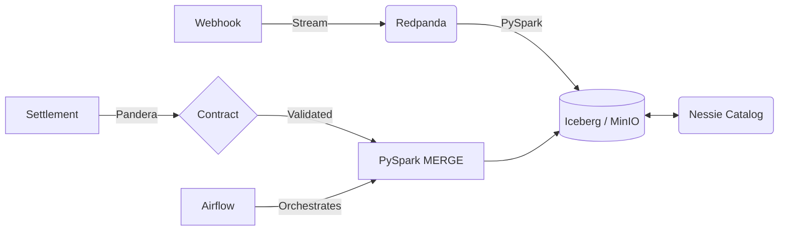

<div align="center">


# Transaction Reconciliation

> **A local data lakehouse for payment gateway reconciliation, correct by construction.**


</div>

**The Problem:** Finance teams manually match payment gateway webhooks against delayed bank settlement files to verify Merchant Discount Rates (MDR). This manual process causes month-end delays and masks revenue leakage.

**The Solution:** An automated pipeline that reconciles real-time webhooks against batch settlements using Iceberg MERGE, with instrument-aware fee calculation and configurable rate cards.

---

## What This Is (and Isn't)

**This is:**
- A working local proof-of-concept for streaming + batch reconciliation
- A demonstration of Iceberg MERGE for incremental updates
- A reference architecture for payment reconciliation

**This is NOT:**
- Production-ready — it runs on Docker Compose, not a Spark cluster
- A payments system — it processes synthetic data, not real money
- Scalable to billions of transactions — benchmarks are single-node only

---

## Architecture



| Local Component | Cloud Equivalent |
| :--- | :--- |
| Redpanda (Docker) | Amazon MSK / Confluent Cloud |
| MinIO (Docker) | Amazon S3 / GCS |
| Nessie (Docker) | AWS Glue Data Catalog |
| PySpark on Docker | EMR / Dataproc |
| Airflow on Docker | MWAA / Cloud Composer |

---

## Key Features

| Feature | Implementation |
| :--- | :--- |
| **Instrument-aware fees** | Hardcoded per instrument type (UPI, CC, DC, etc.) in MERGE SQL |
| **GST on MDR** | Automatic GST calculation on the MDR fee |
| **ACID MERGE** | Iceberg MERGE INTO with WHEN NOT MATCHED handling |
| **Data contracts** | Pandera schemas with strict type + uniqueness checks |
| **Quarantine** | Invalid records isolated, not dropped |
| **Dead Letter Queue** | Failed webhook records captured in separate Iceberg table |

---

## Quick Start

```bash
# 1. Start infrastructure
docker compose up -d

# 2. Run the full pipeline via Airflow
# Airflow UI: http://localhost:8080 (admin/admin)
# DAG: daily_tx_reconciliation

# 3. Or run individual steps manually
python src/generators/settlement_generator.py
python src/validation/validate_settlement.py
```

---

## Configuration

All configuration is centralized in `src/common/settings.py` using `pydantic-settings`. Values load from `.env` + environment overrides.

---

## Project Structure

```text
├── dags/                    # Airflow DAG definitions
├── src/
│   ├── common/              # Settings and Spark session management
│   ├── generators/          # Mock data generation (settlements)
│   ├── processing/          # MERGE reconciliation
│   └── validation/          # Pandera data contracts
├── tests/
│   ├── processing/          # Reconciliation unit tests
│   ├── validation/          # Schema validation tests
│   └── common/              # Config tests
└── docker-compose.yml       # Local infrastructure
```
