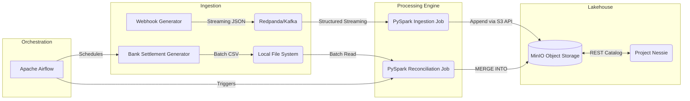

# Transaction Reconciliation Engine

An end-to-end data pipeline that reconciles real-time payment gateway webhooks against delayed bank settlement files. Built with PySpark, Apache Iceberg, Redpanda (Kafka), MinIO (S3), Project Nessie, and orchestrated with Apache Airflow.

## The Problem
When a customer pays, the gateway fires a webhook. But the bank doesn't actually deposit the money for 1-2 days, and when they do, they deduct a flat fee (MDR). Finance teams waste hours manually matching these records in Excel to find missing funds.

This project automates that matching process at scale.

## Architecture



## Tech Stack
* **Stream Ingestion:** Redpanda (Kafka compatible)
* **Processing & Data Quality:** Apache Spark (PySpark)
* **Storage:** Apache Iceberg + MinIO (S3 compatible)
* **Metastore / Catalog:** Project Nessie (Data as Code REST Catalog)
* **Orchestration:** Apache Airflow
* **Testing & CI/CD:** Pytest, Chispa, GitHub Actions
* **Infrastructure:** Docker Compose

## Getting Started (Windows)

1. Open PowerShell in this directory.
2. Run the setup script to create a virtual environment, install dependencies, and start the Docker containers:
   ```powershell
   .\setup.ps1
   ```
3. Generate mock webhook data (simulating gateway traffic):
   ```powershell
   python src/generators/webhook_producer.py
   ```
4. In a new terminal, start the streaming ingestion job. Valid records go to Iceberg, invalid ones go to a Dead Letter Queue (DLQ):
   ```powershell
   .\.venv\Scripts\Activate.ps1
   python src/ingest_webhooks.py
   ```
5. Log into Airflow at `http://localhost:8080` (admin/admin) and unpause the `daily_tx_reconciliation` DAG. The DAG will automatically generate a delayed bank settlement CSV and run the PySpark `MERGE INTO` batch reconciliation.

## Data Quality & Testing
* **Data Quality:** The ingestion pipeline includes native PySpark constraints to route malformed webhooks (negative amounts, missing IDs) to a Dead Letter Queue (DLQ).
* **Testing:** Run `pytest tests/` to execute the DataFrame equality tests (powered by Chispa). Tests are automatically run on push via GitHub Actions.

## System Capabilities

* **End-to-End Lakehouse Architecture:** Implements a complete local data lakehouse utilizing **Apache Iceberg**, **MinIO (S3-compatible)**, and **Project Nessie** (REST catalog), maintaining enterprise-level design patterns without cloud dependencies.
* **Dual-Pipeline Processing:** Utilizes a **PySpark** architecture that ingests real-time payment webhooks via **Redpanda (Kafka)** using Structured Streaming, while processing delayed bank settlement CSVs via Batch processing.
* **Resilient Data Quality & DLQ:** Enforces strict data validation constraints during ingestion. Corrupt or malformed records (e.g., missing IDs or negative amounts) are automatically routed to an Iceberg Dead Letter Queue (DLQ) table, preventing pipeline interruption.
* **ACID Upserts & Reconciliation:** Employs Iceberg's `MERGE INTO` capabilities via PySpark to perform complex matching logic between payments and settlements, automatically flagging fee discrepancies (MDR) as exceptions.
* **Orchestration & CI/CD:** Orchestrates the batch processing lifecycle using **Apache Airflow** within a custom Docker environment. Ensures code reliability through **Pytest** and **Chispa** unit tests, automated by a **GitHub Actions** CI pipeline.
