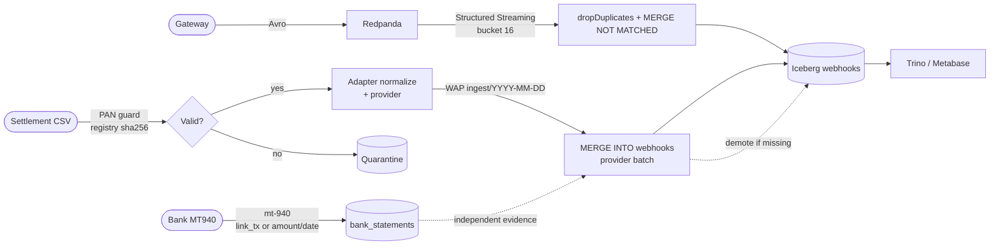
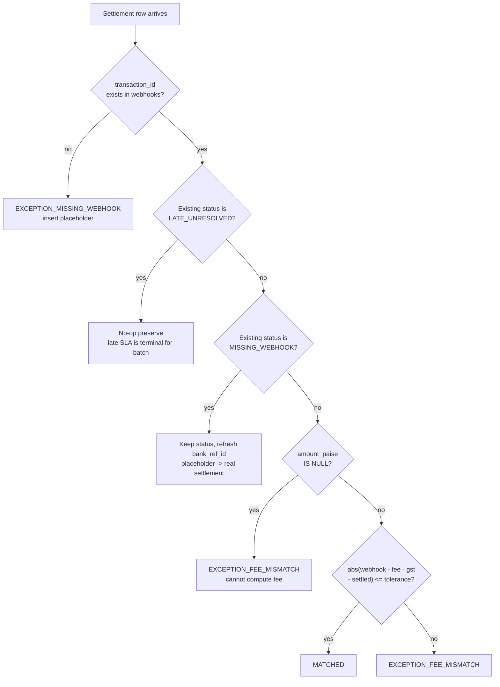

# Architecture

System design for the tx-recon reconciliation pipeline.

## Three legs, one table

tx-recon has three data legs that converge on a single Iceberg table:

1. **Streaming ingestion** (real-time): Webhooks arrive via Kafka, are decoded from Avro, deduplicated, and upserted into the `webhooks` Iceberg table via a `MERGE ... WHEN NOT MATCHED` inside `foreachBatch`. This path runs continuously. Table layout is `PARTITIONED BY bucket(16, transaction_id)` so MERGE prunes to file groups.

2. **Batch reconciliation** (daily, by provider batch): A settlement CSV arrives, is scanned for PAN (Luhn), de-duplicated by content hash, validated by Pandera, normalized by an adapter that stamps `provider`, and merged by provider batch `{provider}:{batch_date}` against the webhook table via `MERGE INTO ... ON transaction_id` on an Iceberg WAP branch. The branch merges to `main` only on gate pass. This path runs once per day per provider via `pipeline.py` or Airflow.

3. **Bank evidence** (independent truth): Bank statement MT940 files are parsed via the `mt-940` package (never hand-rolled) into `bank_statements` and joined to settlements. MATCHED rows without bank evidence demote to `EXCEPTION_MISSING_BANK_STATEMENT` — without this third leg, a gateway-consistent error is invisible.



## MERGE decision tree

The batch MERGE in `reconcile.py` evaluates rows in this order. The first matching clause wins.



The fee and tolerance in step H are computed per-row via a `CASE` expression that selects the correct rate card by instrument type, merchant ID, and settlement date. See "Versioned rate cards" below.

Rows already marked `LATE_UNRESOLVED` by the late-SLA pass (`LATE_SLA_DAYS`, default 7) hit the preserving no-op clause first, so re-runs stay idempotent; only a late-arriving webhook heals them via the ingestion MERGE.

## Table layout

`ensure_webhook_table()` (`src/ingestion/ingest_webhooks.py`) creates `PARTITIONED BY bucket(16, transaction_id)` with `WRITE ORDERED BY transaction_id` and `merge-on-read` for data/deletes/updates. This co-locates MERGE join keys so batches prune to file groups instead of full-scanning history (verified live). The spec applies to new tables only (`IF NOT EXISTS`); migrating an unpartitioned table requires create-new + insert + swap, never in-place alteration.

## Streaming dedup

The ingestion path (`ingest_webhooks.py`) uses `foreachBatch` with a single sink (not dual `toTable`). Each micro-batch:

1. Strips the Confluent wire header (magic byte + schema ID) and carries `schema_id` alongside `fixed_value`.
2. Decodes Avro via `from_avro` with the pinned `WEBHOOK_AVRO_SCHEMA` and checks schema-id drift against the registry (warn-only unless `REQUIRE_SCHEMA_REGISTRY=1`).
3. Splits valid (`amount_paise > 0 AND transaction_id IS NOT NULL`) from invalid using `coalesce` to catch `NULL` from corrupt decode (3VL problem).
4. Deduplicates valid rows by `transaction_id` via `dropDuplicates` (watermark `STREAM_WATERMARK_DELAY`, default `1 day`, bounds state).
5. Upserts valid rows via `MERGE INTO ... WHEN NOT MATCHED THEN INSERT *` (with healing of `EXCEPTION_MISSING_WEBHOOK` placeholders when a late webhook arrives).
6. Appends invalid rows to the DLQ table (single guarded write; skipped when the batch has none).
7. Counts late rows (`event_time < now - INTERVAL`) as a side-output warning.

Checkpoint at `warehouse/checkpoints/webhooks_all` gives Spark streaming exactly-once semantics. Registry unreachable disables the drift comparison without blocking ingestion unless `REQUIRE_SCHEMA_REGISTRY=1` (fail-closed).

## Versioned rate cards

`config/fee_rates.yaml` contains a `history` list of rate cards, each with `effective_from` and `effective_to` dates. The `FeeEngine` selects the card where the settlement date falls within the range. The SQL builder emits a versioned `CASE`:

```sql
CASE
  WHEN s.settlement_date >= '2025-04-01' THEN <v2 fee CASE>
  ELSE <v1 fee CASE>
END
```

Each version's inner CASE covers merchant overrides first (most specific), then instrument overrides, then the default rate. The same integer-only formula (`(amount * bps + 5000) DIV 10000`) appears in both Python and Spark SQL.

## Merchant-aware MERGE

Per-merchant negotiated rates override instrument rates. The SQL builder generates `WHEN merchant_id = 'X' AND instrument_type = 'Y' THEN ...` clauses before the instrument-only clauses. Settlements without a `merchant_id` get `COALESCE(s.merchant_id, 'UNKNOWN')`.

This means a credit card payment from `merch_001` (180 bps) is reconciled differently from the same instrument at standard rate (200 bps).

## Provider batches

Calendar-date joins create false MISSINGs (cross-midnight cutoffs, holidays, multi-day cycles). Every settlement belongs to a provider batch `{provider}:{batch_date}` defined in `config/providers.yaml` (see `src/processing/batches.py`):

- `lag_days` — webhook..settlement window still considered on-time (used for `within_lag` and the `missing_within_lag` gauge).
- `late_sla_days` — MISSING older than this flips to `LATE_UNRESOLVED` per-provider (global default 7, overridden by env `LATE_SLA_DAYS`).
- `cadence`/`cutoff` — documents expected drop frequency and rail cut-off (e.g. Razorpay `22:00 Asia/Kolkata`).

The settlement adapter stamps `provider` into the canonical row; `_settlement_source` and the late-SLA MERGE consult `load_providers`/`provider_spec` so each provider's rows are evaluated against its own window. The `missing_within_lag` gauge is computed before the late-SLA MERGE (which consumes MISSING rows) and is excluded from `check_batch_drift`.

## Bank third leg

`src/adapters/bank_statement.py` delegates to the `mt-940` package (typed, fixture-tested) — never hand-rolled SWIFT. `parse_mt940` extracts `bank_ref`, signed `amount_paise` (HALF_UP), `value_date`, `direction`, `link_tx` (from `TXN\d{6,}` in narration), and `narration`. `src/processing/reconcile.py: build_bank_leg_sql/reconcile_bank_leg` joins it after the main MERGE: evidence is an exact `link_tx` match OR (net within 1 paise AND value date within `lag_days`). MATCHED rows without evidence demote via `MERGE ... WHEN MATCHED AND status=MATCHED THEN UPDATE -> EXCEPTION_MISSING_BANK_STATEMENT`; bank rows matching nothing are counted as orphans (logged, not statused). The DLQ/bank tables share the bucket layout.

## Residual scorer

After the rule-based MERGE, a downgrade-only residual scorer (`src/processing/residual.py`) can demote `MATCHED` rows to `EXCEPTION_FEE_MISMATCH` when the match is suspicious (e.g. merchant-rate disagreement). It never promotes `MISMATCH -> MATCHED`, so false positives are monotone non-increasing. Proven in `docs/PROOF.md`.

The scorer uses a sigmoid on the difference between default-rate expected and actual settled amount. Threshold `tau` (default 0.9) controls sensitivity. On clean real rows the residual is identity: no rows are demoted.

Production scoring runs in SQL: `score_match_sql()` ports the exact curve (merchant-disagreement branch plus sigmoid on the worst excess) reusing the fee/tolerance builders, and `apply_residual` demotes via a single set-based `MERGE` — no driver `collect()`. The pure-Python `score_match` remains the auditable oracle; a golden test pins SQL ≈ Python.

## Iceberg maintenance

`maintain_tables()` runs in dependency order after each successful MERGE (verified order: `expire_snapshots -> remove_orphan_files (minAge 3d, never sweeps in-flight WAP) -> rewrite_data_files(binpack) -> rewrite_manifests`, see `src/processing/reconcile.py: maintain_tables`). Default `retain_last=7` (via `MAINTAIN_RETAIN_LAST`) preserves roughly a week of time-travel while bounding delete-file debt. Each step is logged and recorded per-table (`files_before/after`, `status: failed` with `error` when a statement throws); maintenance never raises — it never fails a batch — but failures are visible in the `Maintenance complete` log and the returned dict. Callers gate on `status` (see RUNBOOK), not on silence.

The 64–128 MB `write.target-file-size-bytes` plus hash distribution keeps file counts bounded; `MAINTAIN_AFTER_MERGE=0` disables the post-MERGE run (bench hygiene runs its own).

## Write-Audit-Publish

The batch boundary enforces a Write-Audit-Publish pattern:

1. **Write:** Pandera validates the settlement CSV against `settlement_schema` (strict types, real calendar dates, `UNKNOWN` instrument fallback → quarantine, not silent pricing).
2. **Audit:** Three guards run before the MERGE:
   - **PAN gate** (`src/validation/pan_guard.py`): Luhn-checked scan of free-text/ID columns fails the batch if a card number is present — one PAN puts the whole lake in PCI scope.
   - **File registry** (`src/validation/file_registry.py`): `sha256` of raw bytes recorded in `.processed_files.json`; redelivery under a different name is flagged (idempotent re-merge, not double count).
   - **Quarantine:** Invalid rows isolated to `quarantine_YYYYMMDD.csv`; the pipeline raises `SettlementValidationError` and stops. Validated rows persist as `curated_<basename>.csv` (PG-normalized: INR→paise, ISO dates, canonical instruments + `provider`). `curated_*` survives into the MERGE; `quarantine_*` never merges (`_settlement_source` globs only `settlement_*`/`curated_*`).
3. **Publish:** Only validated, PAN-clean rows on a WAP branch reach Spark for the MERGE. See WAP below.

This prevents corrupt data (negative amounts, duplicate IDs, bad dates, PAN) from entering the Iceberg table.

## WAP branches

`src/processing/wap.py` implements Iceberg-native branching (not Nessie-level branching — Nessie Spark-SQL extensions speak API v1 while the server is v2, so Nessie `CREATE BRANCH` statements fail here, verified live):

- `enable_wap(table)`: `ALTER TABLE ... SET TBLPROPERTIES ('write.wap.enabled'='true')` — one-time per table, the property persists.
- `use_branch(spark, branch)`: `spark.conf.set("spark.wap.branch", "ingest/YYYY-MM-DD")` — routes subsequent writes to the branch. Conf alone leaks to `main` (verified); both the property and the conf are required for isolation.
- `create_branch` / `drop_branch`: `ALTER TABLE ... CREATE/DROP BRANCH IF EXISTS <branch>` (idempotent).
- `merge_branch`: `CALL catalog.system.fast_forward(table=>'db.webhooks', branch=>'main', to=>'ingest/...')` — publish only after validation + match-rate gates pass on the branch. Failed validation leaves the branch dropped, `main` untouched. Branches are short-lived (`ingest/YYYY-MM-DD`, TTL 3 days).

## Fail-closed switches

Defaults are strict (`src/common/settings.py`): `strict_slo=true` (sub-SLO match rate, stale mart, volume/staleness fail the batch), `REQUIRE_KAFKA_SASL`/`REQUIRE_SCHEMA_REGISTRY` refuse plaintext/trust-on-bad-registry, `ALLOW_DESTRUCTIVE_SEED` must be set for real-data webhook seeding (MERGE-DELETE). Secrets follow `*_FILE` (mounted file wins over empty env, explicit env wins over file). Unknown PG instruments normalize to `UNKNOWN` and quarantine via the schema `isin` check — never silently priced as `CREDIT_CARD`.

## Integer paise

All financial amounts are integers (paise). No floating-point money. The formula `(amount * bps + 5000) // 10000` uses floor division with half-up rounding, and the same arithmetic appears in both Python (`fee_engine.py`) and Spark SQL (`reconcile.py: DIV 10000`). This eliminates the rounding drift that affects float-based fee calculations.

## Corrections

The MERGE mutates statuses in place by design; the audit counterweight is append-only. `src/processing/corrections.py: journal_correction` requires `reason` + `approved_by` (maker-checker) and appends to `data/corrections.jsonl`. `scripts/replay_dlq.py` now requires `--reason`/`--approved-by` and journals the purge after a successful replay. Every manual money mutation recorded, no entry without two eyes.

## Component mapping

| Local (Docker) | Production equivalent |
| :--- | :--- |
| Redpanda | Amazon MSK / Confluent Cloud |
| MinIO | Amazon S3 / GCS |
| Nessie (API v2, Spark extensions v1) | AWS Glue Data Catalog / Nessie REST (Iceberg-native branches preferred) |
| PySpark on host / `spark-master` | Amazon EMR / Dataproc |
| `pipeline.py` cron | MWAA / Cloud Composer |
| Trino + Metabase | Athena / Looker |
| `mt-940` (bank leg) | SWIFT MT940 / camt.053 parsers (never hand-rolled) |

## Project structure

```
src/
  adapters/        PG settlement normalizers (Razorpay/Cashfree/PayU/Generic) + bank_statement (MT940) + real_data (thiru 13.3M)
  common/          Settings (strict flags, *_FILE secrets), Spark session, domain contracts
  ingestion/       Spark streaming Kafka -> Iceberg (+DLQ, schema-id drift, late-data, bucket 16)
  processing/      FeeEngine + MERGE reconciliation (4×UPDATE/1×INSERT) + residual scorer + batches (provider windows) + wap (branches) + corrections (journal)
  validation/      Pandera schemas + quarantine + pan_guard (Luhn) + file_registry (sha256)
  pipeline.py      validate (PAN/registry/curated) -> reconcile (provider batch, per-provider SLA, bank leg) -> metrics.json + maintenance (real data only, fail-closed)
config/
  fee_rates.yaml   versioned rate cards (effective_from/to, merchant overrides, instruments)
  providers.yaml   per-provider lag_days / late_sla_days / cutoff / cadence
sql/marts/         fact_reconciliation mart (migrations/V* is source of truth)
```
