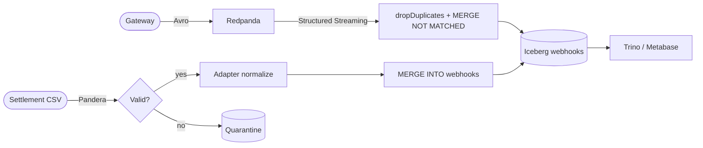
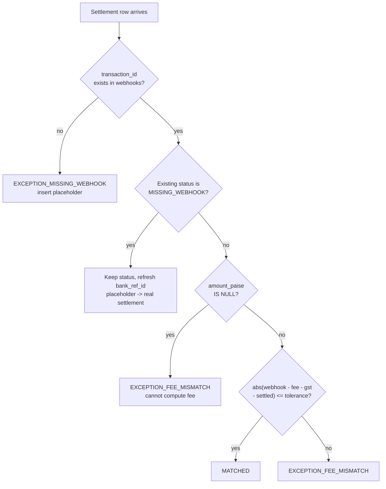

# Architecture

System design for the tx-recon reconciliation pipeline.

## Two paths, one table

tx-recon has two data paths that converge on a single Iceberg table:

1. **Streaming ingestion** (real-time): Webhooks arrive via Kafka, are decoded from Avro, deduplicated, and upserted into the `webhooks` Iceberg table via a `MERGE ... WHEN NOT MATCHED` inside `foreachBatch`. This path runs continuously.

2. **Batch reconciliation** (daily): A settlement CSV arrives, is validated by Pandera, normalized by an adapter, and merged against the webhook table via `MERGE INTO ... ON transaction_id`. This path runs once per day via `pipeline.py` or Airflow.



## MERGE decision tree

The batch MERGE in `reconcile.py` evaluates rows in this order. The first matching clause wins.



The fee and tolerance in step H are computed per-row via a `CASE` expression that selects the correct rate card by instrument type, merchant ID, and settlement date. See "Versioned rate cards" below.

## Streaming dedup

The ingestion path (`ingest_webhooks.py`) uses `foreachBatch` with a single sink (not dual `toTable`). Each micro-batch:

1. Strips the Confluent wire header (magic byte + schema ID).
2. Decodes Avro via `from_avro`.
3. Splits valid (`amount_paise > 0 AND transaction_id IS NOT NULL`) from invalid using `coalesce` to catch `NULL` from corrupt decode (3VL problem).
4. Deduplicates valid rows by `transaction_id` via `dropDuplicates`.
5. Upserts valid rows via `MERGE INTO ... WHEN NOT MATCHED THEN INSERT *`.
6. Appends invalid rows to the DLQ table.

Checkpoint at `warehouse/checkpoints/webhooks_all` gives Spark streaming exactly-once semantics.

## Versioned rate cards

`config/fee_rates.yaml` contains a `history` list of rate cards, each with `effective_from` and `effective_to` dates. The `FeeEngine` selects the card where the settlement date falls within the range. The SQL builder emits a versioned `CASE`:

```sql
CASE
  WHEN s.settlement_date >= '2025-04-01' THEN <v2 fee CASE>
  ELSE <v1 fee CASE>
END
```

Each version's inner CASE covers merchant overrides first (most specific), then instrument overrides, then the default rate. The same integer-only formula (`(amount * bps + 5000) DIV 10000`) appears in both Python and Spark SQL.

## Merchant-aware MERGE

Per-merchant negotiated rates override instrument rates. The SQL builder generates `WHEN merchant_id = 'X' AND instrument_type = 'Y' THEN ...` clauses before the instrument-only clauses. Settlements without a `merchant_id` get `COALESCE(s.merchant_id, 'UNKNOWN')`.

This means a credit card payment from `merch_001` (180 bps) is reconciled differently from the same instrument at standard rate (200 bps).

## Residual scorer

After the rule-based MERGE, a downgrade-only residual scorer (`src/processing/residual.py`) can demote `MATCHED` rows to `EXCEPTION_FEE_MISMATCH` when the match is suspicious (e.g. merchant-rate disagreement). It never promotes `MISMATCH -> MATCHED`, so false positives are monotone non-increasing. Proven in `docs/PROOF.md`.

The scorer uses a sigmoid on the difference between default-rate expected and actual settled amount. Threshold `tau` (default 0.9) controls sensitivity. On the sealed harness (F1=1.0, FP=0), the residual is identity: no rows are demoted.

## Write-Audit-Publish

The batch boundary enforces a Write-Audit-Publish pattern:

1. **Write:** Pandera validates the settlement CSV against `settlement_schema` (strict types, uniqueness, real calendar dates).
2. **Audit:** Invalid rows are isolated to `quarantine_YYYYMMDD.csv`. The pipeline raises `SettlementValidationError` and stops.
3. **Publish:** Only validated rows reach Spark for the MERGE.

This prevents corrupt data (negative amounts, duplicate IDs, bad dates) from entering the Iceberg table.

## Integer paise

All financial amounts are integers (paise). No floating-point money. The formula `(amount * bps + 5000) // 10000` uses floor division with half-up rounding, and the same arithmetic appears in both Python (`fee_engine.py`) and Spark SQL (`reconcile.py: DIV 10000`). This eliminates the rounding drift that affects float-based fee calculations.

## Component mapping

| Local (Docker) | Production equivalent |
| :--- | :--- |
| Redpanda | Amazon MSK / Confluent Cloud |
| MinIO | Amazon S3 / GCS |
| Nessie | AWS Glue Data Catalog |
| PySpark on host | Amazon EMR / Dataproc |
| `pipeline.py` cron | MWAA / Cloud Composer |
| Trino + Metabase | Athena / Looker |

## Project structure

```
src/
  adapters/        PG settlement normalizers (Razorpay, Cashfree, PayU, Generic)
  common/          Settings, Spark session, domain contracts
  generators/      Webhook producer + settlement file generator
  ingestion/       Spark streaming Kafka -> Iceberg (+DLQ)
  processing/      FeeEngine + MERGE reconciliation + residual scorer
  validation/      Pandera schemas + quarantine
  pipeline.py      generate -> validate -> reconcile (cron entrypoint)
```
