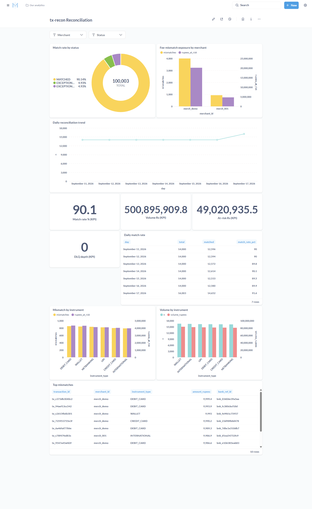
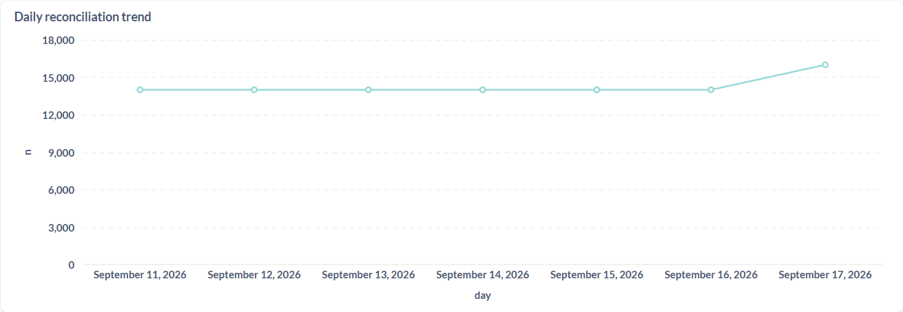
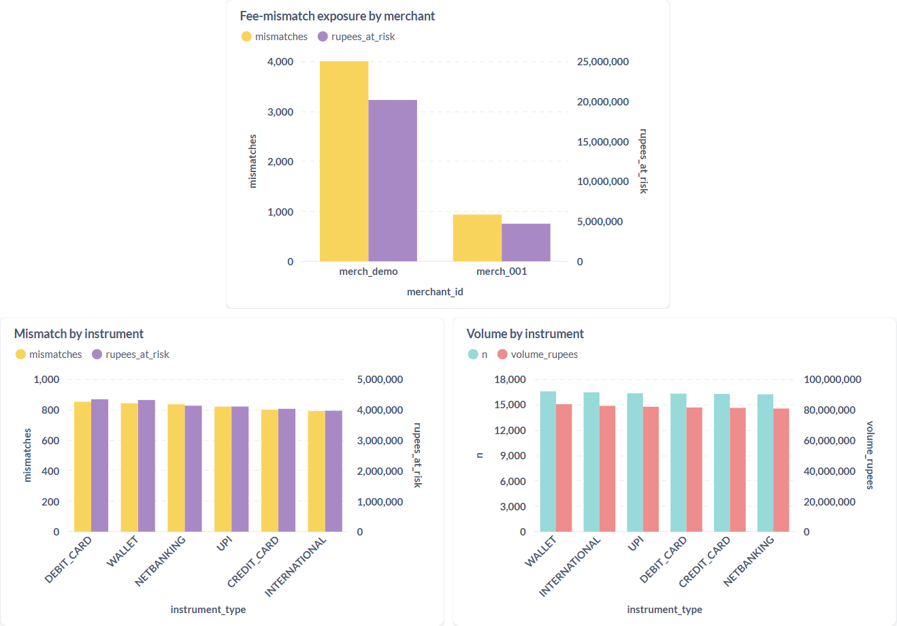
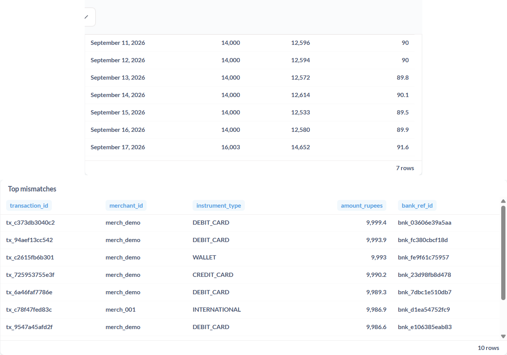

# Dashboard tour

Metabase (`http://localhost:3001/dashboard/2`) over Trino (`nessie.db`) over the
Iceberg `webhooks` table. Full screenshot:

> Demo data is synthetic: ~100K rows across 7 days (Sep 11–17, 2026) seeded with
> a realistic messy mix (~90% MATCHED, ~5% fee mismatch, ~5% missing webhook).
> The 2,003 oldest rows predate the `instrument_type` column and show NULL there.

Open it: `docker compose up -d` → seed a batch (`python -m src.pipeline --demo --messy`)
→ Metabase → Trino database (host `trino`, port `8080`, catalog `nessie`, schema `db`).
Two dashboard filters (merchant, status) apply to every card.

## KPI row

Four headline scalars, the first things to check each morning:

- **Match rate %** ([kpi_match_rate.sql](../sql/questions/kpi_match_rate.sql)) —
  share of rows MATCHED. Compare against the PROOF accuracy gate; a dip means a
  bad settlement file or a rate-card change, not normal noise.
- **Volume Rs** ([kpi_volume_rupees.sql](../sql/questions/kpi_volume_rupees.sql)) —
  total reconciled volume in rupees. Sanity anchor: if this drops day-over-day,
  ingestion stalled.
- **At-risk Rs** ([kpi_at_risk_rupees.sql](../sql/questions/kpi_at_risk_rupees.sql)) —
  rupees sitting in non-MATCHED rows. Zero is the goal; this is the money that
  needs investigation.
- **DLQ depth** ([dlq_depth.sql](../sql/questions/dlq_depth.sql)) — rows in
  `webhooks_dlq` (poison/corrupt webhook traffic). Flat zero is healthy;
  sustained growth means a producer or schema problem.

## Match rate by status

Share of transactions per `reconciliation_status`
([match_rate.sql](../sql/questions/match_rate.sql)). With the messy demo mix the
pie reads ~90% MATCHED, ~5% `EXCEPTION_FEE_MISMATCH`, ~5%
`EXCEPTION_MISSING_WEBHOOK`. A new slice appearing (duplicates, invalid) is the
signal that a new failure mode started.

## Fee-mismatch exposure by merchant

Top card in the bars shot below: rupees at risk per merchant, worst first
([exceptions_by_merchant.sql](../sql/questions/exceptions_by_merchant.sql)).
Answers "which merchant do I call first?" — one merchant usually dominates,
which points at their settlement file or negotiated rate card rather than a
systemic bug.

## Daily reconciliation trend

Row counts per day per status ([daily_trend.sql](../sql/questions/daily_trend.sql)).
One point per batch day; a second status band appearing on a new day marks
exactly when a failure mode started. Gaps mean no batch ran that day.

## Instrument breakdown

Middle and bottom cards in this shot:

- **Mismatch by instrument**
  ([mismatch_by_instrument.sql](../sql/questions/mismatch_by_instrument.sql)) —
  fee-mismatch counts and rupees per payment method. Methods with higher MDR
  (credit card, international) dominate mismatch exposure; a spike on a normally
  clean method (UPI) smells like a bad file, not bad rates.
- **Volume by instrument**
  ([volume_by_instrument.sql](../sql/questions/volume_by_instrument.sql)) —
  row counts and rupees per method. Reference distribution: use it to tell a
  real mismatch spike (shape differs from volume shape) from a proportional one.

## Daily match rate + top mismatches

- **Daily match rate** ([daily_match_rate.sql](../sql/questions/daily_match_rate.sql)) —
  per-day totals, matched counts, and match-rate %. The batch-health ledger: any
  day below the gate gets investigated via its `processing_run_id`.
- **Top mismatches** ([top_mismatches.sql](../sql/questions/top_mismatches.sql)) —
  the 10 largest fee mismatches by amount with transaction, merchant,
  instrument, and bank reference. The starting worklist for the investigation
  the merchant bar only summarizes.
